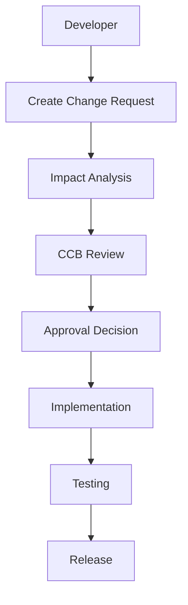
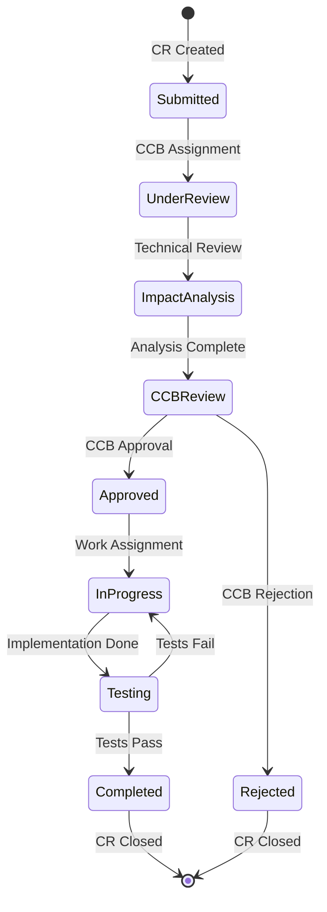
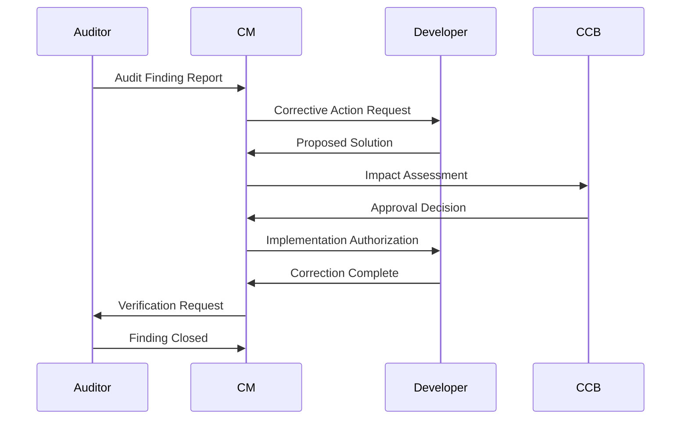
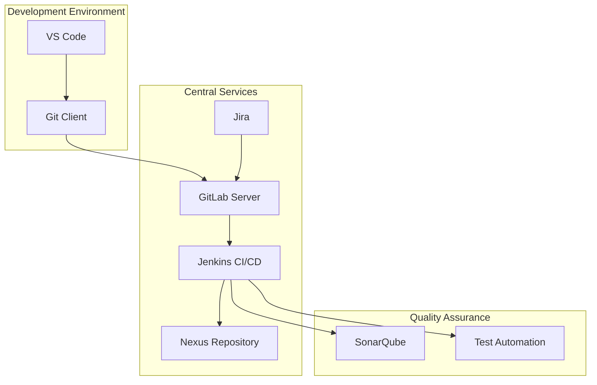

# Software Configuration Management Plan (SCMP)
## AEGIS-SE Defense Platform

**Document ID**: SCMP-AEGIS-SE-001
**Version**: 1.0
**Date**: September 26, 2025
**Classification**: UNCLASSIFIED
**Prepared for**: Department of Defense
**Prepared by**: AEGIS-SE Development Team

---

## Document Control

| Version | Date | Author | Description of Changes |
|---------|------|--------|------------------------|
| 1.0 | 2025-09-26 | AEGIS-SE Team | Initial release |

---

## Table of Contents

1. [Introduction](#1-introduction)
2. [Configuration Management Organization](#2-configuration-management-organization)
3. [Configuration Identification](#3-configuration-identification)
4. [Configuration Control](#4-configuration-control)
5. [Configuration Status Accounting](#5-configuration-status-accounting)
6. [Configuration Audits](#6-configuration-audits)
7. [Release Management](#7-release-management)
8. [Tools and Environment](#8-tools-and-environment)

---

## 1. Introduction

### 1.1 Purpose

This Software Configuration Management Plan (SCMP) defines the configuration management approach for the AEGIS-SE Defense Platform, ensuring traceability, control, and integrity of all software components throughout the development lifecycle.

### 1.2 Scope

The SCMP covers all software configuration items (SCIs) including:

- Source code (C/C++, Python, VHDL)
- Documentation (requirements, design, test)
- Configuration files and parameters
- Build scripts and deployment artifacts
- Third-party components and libraries

### 1.3 Configuration Management Objectives

| Objective | Description | Success Criteria |
|-----------|-------------|------------------|
| **Traceability** | Complete change history tracking | 100% change attribution |
| **Control** | Authorized changes only | Zero unauthorized modifications |
| **Integrity** | Prevent corruption and loss | Checksums and backups verified |
| **Reproducibility** | Rebuild identical systems | Consistent build results |
| **Compliance** | Meet DoD-STD-2167A requirements | Audit compliance achieved |

---

## 2. Configuration Management Organization

### 2.1 Roles and Responsibilities

#### 2.1.1 Configuration Manager

**Primary Responsibilities**:

- Overall CM process oversight and enforcement
- Configuration Control Board (CCB) coordination
- CM tool administration and maintenance
- Audit planning and execution
- Release coordination and approval

**Qualifications**: 5+ years SCM experience, DoD security clearance

#### 2.1.2 Configuration Control Board (CCB)

**Membership**:

| Role | Representative | Responsibilities |
|------|----------------|------------------|
| **Chairman** | Project Manager | Final approval authority |
| **Technical Lead** | Lead Engineer | Technical impact assessment |
| **Quality Assurance** | QA Manager | Quality compliance verification |
| **Test Manager** | Test Lead | Test impact evaluation |
| **Customer Representative** | DoD Liaison | Mission requirement validation |

**Meeting Schedule**: Weekly during active development, bi-weekly during maintenance

#### 2.1.3 Development Team Responsibilities



### 2.2 Configuration Control Process

#### 2.2.1 Change Request Workflow

```python
class ChangeRequest:
    """Configuration change request management"""

    def __init__(self, requester: str, description: str):
        self.id = self._generate_cr_id()
        self.requester = requester
        self.description = description
        self.status = ChangeRequestStatus.SUBMITTED
        self.priority = self._assess_priority()
        self.affected_items = []

    def submit_for_review(self):
        """Submit CR to CCB for review"""
        self.status = ChangeRequestStatus.UNDER_REVIEW
        self._notify_ccb()
        self._perform_impact_analysis()

    def approve_change(self, ccb_decision: CCBDecision):
        """Process CCB approval decision"""
        if ccb_decision.approved:
            self.status = ChangeRequestStatus.APPROVED
            self._create_work_items()
        else:
            self.status = ChangeRequestStatus.REJECTED
            self._notify_requester(ccb_decision.reason)
```

---

## 3. Configuration Identification

### 3.1 Configuration Item Identification

#### 3.1.1 Software Configuration Items (SCIs)

| SCI Category | Naming Convention | Version Format | Example |
|--------------|-------------------|----------------|---------|
| **Source Code** | `<component>_<module>_v<version>` | Major.Minor.Patch | `flight_control_v2.1.3` |
| **Documents** | `<type>-<component>-<sequence>` | Version.Revision | `SRD-AEGIS-SE-001_v1.2` |
| **Test Cases** | `TEST_<component>_<id>` | Major.Minor | `TEST_AI_ML_001_v1.0` |
| **Configuration** | `CFG_<system>_<env>` | YYYY-MM-DD | `CFG_AEGIS_PROD_2025-09-26` |

#### 3.1.2 Configuration Item Structure

```yaml
# Configuration Item Metadata
configuration_item:
  id: "SCI-FC-001"
  name: "Flight Control System"
  type: "source_code"
  classification: "UNCLASSIFIED"

  version:
    major: 2
    minor: 1
    patch: 3
    build: 1247

  dependencies:
    - id: "SCI-HAL-001"
      version: "1.3.2"
    - id: "SCI-SAFETY-001"
      version: "3.0.1"

  files:
    - path: "src/embedded-systems/flight-control/flight_control_system.c"
      checksum: "sha256:a1b2c3d4..."
    - path: "src/embedded-systems/flight-control/flight_control_system.h"
      checksum: "sha256:e5f6g7h8..."

  change_history:
    - version: "2.1.3"
      date: "2025-09-26"
      author: "flight.engineer@aegis.mil"
      change_request: "CR-2025-0847"
      description: "Added emergency landing mode"
```

### 3.2 Version Control Strategy

#### 3.2.1 Git Branching Model

```mermaid
gitgraph
    commit id: "Initial"
    branch develop
    checkout develop
    commit id: "Feature A"
    branch feature/ai-enhancement
    checkout feature/ai-enhancement
    commit id: "AI work"
    checkout develop
    merge feature/ai-enhancement
    commit id: "Integration"
    checkout main
    merge develop
    commit id: "Release v2.1.0"
    tag: "v2.1.0"
```

**Branch Types**:

| Branch Type | Purpose | Naming Convention | Merge Policy |
|-------------|---------|-------------------|--------------|
| `main` | Production releases | `main` | Protected, requires CCB approval |
| `develop` | Integration branch | `develop` | Automated testing required |
| `feature/*` | Feature development | `feature/<feature-name>` | Pull request + review |
| `hotfix/*` | Critical bug fixes | `hotfix/<issue-id>` | Fast-track CCB approval |
| `release/*` | Release preparation | `release/<version>` | Freeze for stabilization |

#### 3.2.2 Commit Standards

```bash
# Commit Message Format
<type>(<scope>): <subject>

<body>

<footer>

# Example:
feat(flight-control): add emergency landing mode

Implemented automatic emergency landing capability with:
- Terrain avoidance using radar altimeter
- Optimal landing site selection algorithm
- Emergency power management

Resolves: CR-2025-0847
Tested-by: flight.test.engineer@aegis.mil
Reviewed-by: tech.lead@aegis.mil
```

**Commit Types**:

- `feat`: New feature
- `fix`: Bug fix
- `docs`: Documentation changes
- `style`: Code formatting
- `refactor`: Code restructuring
- `test`: Test additions/modifications
- `chore`: Build/deployment changes

---

## 4. Configuration Control

### 4.1 Change Control Process

#### 4.1.1 Change Request (CR) Lifecycle



#### 4.1.2 Impact Analysis Template

```markdown
# Change Request Impact Analysis

**CR ID**: CR-2025-XXXX
**Analyst**: [Name]
**Date**: [YYYY-MM-DD]

## Technical Impact
- **Affected SCIs**: [List all affected configuration items]
- **Interface Changes**: [API/protocol modifications]
- **Performance Impact**: [Expected performance changes]
- **Dependencies**: [New or modified dependencies]

## Risk Assessment
| Risk Category | Level | Mitigation |
|---------------|-------|------------|
| Technical Risk | [Low/Med/High] | [Mitigation strategy] |
| Schedule Risk | [Low/Med/High] | [Impact on timeline] |
| Quality Risk | [Low/Med/High] | [Additional testing needed] |

## Resource Requirements
- **Development Effort**: [Person-hours]
- **Testing Effort**: [Person-hours]
- **Documentation Updates**: [Required documents]
- **Training Requirements**: [User/maintainer training]

## Recommendation
[Approve/Reject with justification]
```

### 4.2 Configuration Control Tools

#### 4.2.1 Automated Control Mechanisms

```python
class ConfigurationController:
    """Automated configuration control enforcement"""

    def __init__(self):
        self.git_hooks = GitHookManager()
        self.build_system = BuildSystemManager()
        self.quality_gates = QualityGateManager()

    def enforce_commit_standards(self, commit_info):
        """Pre-commit hook for commit message validation"""

        # Validate commit message format
        if not self._validate_commit_format(commit_info.message):
            raise CommitError("Invalid commit message format")

        # Verify change request exists
        cr_id = self._extract_cr_id(commit_info.message)
        if not self._verify_cr_approved(cr_id):
            raise CommitError(f"Change request {cr_id} not approved")

        # Check code quality gates
        quality_results = self.quality_gates.run_checks(commit_info.files)
        if not quality_results.passed:
            raise CommitError("Quality gates failed")

    def enforce_merge_controls(self, merge_request):
        """Pre-merge validation for protected branches"""

        # Require CCB approval for main branch
        if merge_request.target_branch == 'main':
            if not self._has_ccb_approval(merge_request):
                raise MergeError("CCB approval required for main branch")

        # Ensure all tests pass
        ci_status = self._get_ci_status(merge_request)
        if ci_status != 'PASSED':
            raise MergeError("All tests must pass before merge")
```

---

## 5. Configuration Status Accounting

### 5.1 Status Tracking System

#### 5.1.1 Configuration Database Schema

```sql
-- Configuration Items Table
CREATE TABLE configuration_items (
    id VARCHAR(50) PRIMARY KEY,
    name VARCHAR(255) NOT NULL,
    type VARCHAR(50) NOT NULL,
    version VARCHAR(20) NOT NULL,
    status VARCHAR(20) NOT NULL,
    created_date TIMESTAMP DEFAULT CURRENT_TIMESTAMP,
    created_by VARCHAR(100) NOT NULL,
    classification VARCHAR(20) DEFAULT 'UNCLASSIFIED'
);

-- Change Requests Table
CREATE TABLE change_requests (
    id VARCHAR(50) PRIMARY KEY,
    title VARCHAR(255) NOT NULL,
    description TEXT,
    requester VARCHAR(100) NOT NULL,
    priority VARCHAR(20) NOT NULL,
    status VARCHAR(20) NOT NULL,
    ccb_decision VARCHAR(20),
    created_date TIMESTAMP DEFAULT CURRENT_TIMESTAMP,
    approved_date TIMESTAMP,
    completed_date TIMESTAMP
);

-- Configuration Item Changes Table
CREATE TABLE ci_changes (
    id SERIAL PRIMARY KEY,
    ci_id VARCHAR(50) REFERENCES configuration_items(id),
    cr_id VARCHAR(50) REFERENCES change_requests(id),
    old_version VARCHAR(20),
    new_version VARCHAR(20),
    change_date TIMESTAMP DEFAULT CURRENT_TIMESTAMP,
    changed_by VARCHAR(100) NOT NULL
);
```

#### 5.1.2 Status Reports

```python
class ConfigurationStatusReporter:
    """Generate configuration status reports"""

    def generate_weekly_status_report(self):
        """Weekly configuration status summary"""

        report = StatusReport()

        # Configuration item status
        ci_stats = self._get_ci_statistics()
        report.add_section("Configuration Items", {
            "Total SCIs": ci_stats.total_count,
            "Modified This Week": ci_stats.weekly_changes,
            "Pending Changes": ci_stats.pending_changes,
            "Latest Versions": ci_stats.latest_versions
        })

        # Change request status
        cr_stats = self._get_cr_statistics()
        report.add_section("Change Requests", {
            "Submitted": cr_stats.submitted,
            "Under Review": cr_stats.under_review,
            "Approved": cr_stats.approved,
            "Completed": cr_stats.completed
        })

        # Build and release status
        build_stats = self._get_build_statistics()
        report.add_section("Builds & Releases", {
            "Successful Builds": build_stats.successful,
            "Failed Builds": build_stats.failed,
            "Releases This Week": build_stats.releases
        })

        return report
```

### 5.2 Traceability Matrix

#### 5.2.1 Requirements to Implementation Traceability

```python
class TraceabilityManager:
    """Maintain traceability between requirements and implementation"""

    def __init__(self):
        self.traceability_db = TraceabilityDatabase()

    def update_traceability(self, requirement_id: str, implementation_files: List[str]):
        """Update traceability when code changes"""

        # Record forward traceability (req -> impl)
        self.traceability_db.add_forward_trace(
            requirement_id,
            implementation_files,
            change_date=datetime.now()
        )

        # Record backward traceability (impl -> req)
        for file_path in implementation_files:
            self.traceability_db.add_backward_trace(
                file_path,
                requirement_id,
                change_date=datetime.now()
            )

    def generate_traceability_report(self):
        """Generate comprehensive traceability report"""

        requirements = self._get_all_requirements()
        report_data = []

        for req in requirements:
            impl_files = self.traceability_db.get_implementation_files(req.id)
            test_cases = self.traceability_db.get_test_cases(req.id)

            coverage = self._calculate_coverage(req, impl_files, test_cases)

            report_data.append({
                'requirement_id': req.id,
                'implementation_files': impl_files,
                'test_cases': test_cases,
                'coverage_percentage': coverage
            })

        return TraceabilityReport(report_data)
```

---

## 6. Configuration Audits

### 6.1 Audit Planning and Execution

#### 6.1.1 Audit Types and Schedule

| Audit Type | Frequency | Scope | Objectives |
|------------|-----------|-------|------------|
| **Physical Configuration Audit** | Pre-release | All SCIs in release | Verify completeness and consistency |
| **Functional Configuration Audit** | Pre-release | System functionality | Verify requirements satisfaction |
| **Internal Process Audit** | Quarterly | CM processes | Verify process compliance |
| **External Compliance Audit** | Annually | Full system | DoD-STD-2167A compliance |

#### 6.1.2 Physical Configuration Audit (PCA)

```python
class PhysicalConfigurationAudit:
    """Automated PCA execution"""

    def __init__(self, release_candidate):
        self.release = release_candidate
        self.audit_results = AuditResults()

    def execute_pca(self):
        """Execute comprehensive physical configuration audit"""

        # Verify all SCIs are present
        self._verify_sci_completeness()

        # Check version consistency
        self._verify_version_consistency()

        # Validate file integrity
        self._verify_file_integrity()

        # Confirm traceability
        self._verify_traceability_completeness()

        # Generate audit report
        return self._generate_pca_report()

    def _verify_sci_completeness(self):
        """Verify all required SCIs are included in release"""

        required_scis = self._get_required_scis_for_release()
        included_scis = self._get_included_scis()

        missing_scis = set(required_scis) - set(included_scis)
        if missing_scis:
            self.audit_results.add_finding(
                severity="CRITICAL",
                description=f"Missing SCIs: {list(missing_scis)}"
            )

    def _verify_version_consistency(self):
        """Check that all SCI versions are consistent"""

        for sci in self.release.configuration_items:
            declared_version = sci.version
            actual_version = self._get_actual_version(sci)

            if declared_version != actual_version:
                self.audit_results.add_finding(
                    severity="MAJOR",
                    description=f"Version mismatch for {sci.id}: "
                               f"declared {declared_version}, actual {actual_version}"
                )
```

### 6.2 Audit Reporting

#### 6.2.1 Audit Finding Classification

| Severity | Definition | Response Required |
|----------|------------|-------------------|
| **CRITICAL** | Prevents release | Immediate correction |
| **MAJOR** | Significant impact | Correction before release |
| **MINOR** | Low impact | Correction in next release |
| **OBSERVATION** | Process improvement | Consider for improvement |

#### 6.2.2 Corrective Action Process



---

## 7. Release Management

### 7.1 Release Process

#### 7.1.1 Release Types

| Release Type | Purpose | Approval Authority | Testing Requirements |
|--------------|---------|-------------------|---------------------|
| **Major Release** | New capabilities | CCB + Customer | Full test suite |
| **Minor Release** | Enhancements | CCB | Regression + new tests |
| **Patch Release** | Bug fixes | Technical Lead | Targeted testing |
| **Hotfix Release** | Critical fixes | Emergency CCB | Minimal viable testing |

#### 7.1.2 Release Preparation Process

```python
class ReleaseManager:
    """Manage software release process"""

    def __init__(self, release_info):
        self.release = release_info
        self.release_checklist = ReleaseChecklist()

    def prepare_release(self):
        """Execute release preparation workflow"""

        # Phase 1: Pre-release validation
        self._freeze_code_baseline()
        self._execute_release_testing()
        self._perform_security_scan()

        # Phase 2: Release artifacts creation
        self._build_release_artifacts()
        self._generate_release_notes()
        self._create_installation_packages()

        # Phase 3: Quality assurance
        self._execute_pca_audit()
        self._execute_fca_audit()
        self._obtain_release_approval()

        # Phase 4: Release execution
        self._tag_release_baseline()
        self._distribute_release_packages()
        self._update_configuration_database()

        return self._generate_release_report()

    def _freeze_code_baseline(self):
        """Create immutable code baseline for release"""

        # Create release branch
        baseline_tag = f"baseline-{self.release.version}"
        self._create_git_tag(baseline_tag)

        # Lock release branch from further changes
        self._protect_release_branch()

        # Generate baseline manifest
        manifest = self._generate_baseline_manifest()
        self._store_baseline_manifest(manifest)
```

### 7.2 Release Packaging

#### 7.2.1 Deployment Package Structure

```
AEGIS-SE-v2.1.3/
├── README.md                    # Installation instructions
├── CHANGELOG.md                 # Version history
├── LICENSE                      # Software license
├── SECURITY.md                  # Security notices
├── bin/                         # Executable binaries
│   ├── aegis-flight-control
│   ├── aegis-ai-engine
│   └── aegis-crypto-manager
├── lib/                         # Shared libraries
│   ├── libflightcontrol.so
│   ├── libaiml.so
│   └── libcrypto.so
├── config/                      # Configuration files
│   ├── default.yaml
│   ├── mission-profiles/
│   └── security-policies/
├── docs/                        # Documentation
│   ├── installation-guide.pdf
│   ├── user-manual.pdf
│   └── api-reference/
├── scripts/                     # Deployment scripts
│   ├── install.sh
│   ├── uninstall.sh
│   └── system-check.sh
└── fpga/                        # FPGA bitstreams
    ├── crypto-engine.bit
    ├── dsp-core.bit
    └── system-controller.bit
```

#### 7.2.2 Release Validation

```bash
#!/bin/bash
# Release Validation Script

echo "AEGIS-SE Release Validation v1.0"
echo "================================="

# Validate package structure
echo "Checking package structure..."
REQUIRED_DIRS=("bin" "lib" "config" "docs" "scripts" "fpga")
for dir in "${REQUIRED_DIRS[@]}"; do
    if [ ! -d "$dir" ]; then
        echo "ERROR: Missing required directory: $dir"
        exit 1
    fi
done

# Validate checksums
echo "Validating file integrity..."
sha256sum -c checksums.sha256
if [ $? -ne 0 ]; then
    echo "ERROR: Checksum validation failed"
    exit 1
fi

# Test installation
echo "Testing installation process..."
./scripts/install.sh --test-mode
if [ $? -ne 0 ]; then
    echo "ERROR: Installation test failed"
    exit 1
fi

# Validate system functionality
echo "Running system validation tests..."
./bin/aegis-system-test --validation-suite
if [ $? -ne 0 ]; then
    echo "ERROR: System validation failed"
    exit 1
fi

echo "Release validation completed successfully"
```

---

## 8. Tools and Environment

### 8.1 Configuration Management Tools

#### 8.1.1 Tool Stack

| Tool Category | Tool Name | Version | Purpose | License |
|---------------|-----------|---------|---------|---------|
| **Version Control** | Git | 2.40.0 | Source code management | GPL v2 |
| **Repository Hosting** | GitLab Enterprise | 16.1 | Central repository | Proprietary |
| **Build Automation** | Jenkins | 2.401 | CI/CD pipeline | MIT |
| **Artifact Management** | Nexus Repository | 3.37 | Binary artifact storage | Proprietary |
| **Issue Tracking** | Jira | 9.8 | Change request management | Proprietary |
| **Documentation** | Confluence | 8.3 | Document management | Proprietary |

#### 8.1.2 Tool Integration Architecture



### 8.2 Environment Configuration

#### 8.2.1 Development Environment Standards

```yaml
# Development Environment Configuration
development_environment:
  operating_system: "Ubuntu 22.04 LTS"
  git_version: ">=2.40.0"
  python_version: "3.9.16"
  gcc_version: "11.3.0"

  required_tools:
    - name: "pre-commit"
      version: "3.3.3"
      purpose: "Git hooks management"
    - name: "commitizen"
      version: "3.5.2"
      purpose: "Conventional commits"
    - name: "black"
      version: "23.3.0"
      purpose: "Python code formatting"
    - name: "clang-format"
      version: "14.0.0"
      purpose: "C/C++ code formatting"

  git_hooks:
    pre_commit:
      - "run-tests"
      - "check-commit-message"
      - "code-quality-check"
    pre_push:
      - "run-integration-tests"
      - "security-scan"
```

#### 8.2.2 Build Environment Configuration

```dockerfile
# Build Environment Container
FROM ubuntu:22.04

# Install development tools
RUN apt-get update && apt-get install -y \
    build-essential \
    cmake \
    git \
    python3.9 \
    python3.9-dev \
    python3-pip \
    ghdl \
    xilinx-vivado

# Configure Git
RUN git config --global user.name "AEGIS Build System"
RUN git config --global user.email "build@aegis-se.mil"

# Install Python dependencies
COPY requirements-build.txt /tmp/
RUN pip3 install -r /tmp/requirements-build.txt

# Set up build workspace
WORKDIR /workspace
COPY . .

# Configure build environment
ENV CC=gcc-11
ENV CXX=g++-11
ENV PYTHON=/usr/bin/python3.9

# Default build command
CMD ["make", "all"]
```

---

## Appendix A: Change Request Form Template

```markdown
# AEGIS-SE Change Request Form

**CR ID**: [Auto-generated]
**Date**: [YYYY-MM-DD]
**Requester**: [Name and contact]
**Priority**: [Critical/High/Medium/Low]

## Change Description
[Detailed description of the requested change]

## Justification
[Business/technical justification for the change]

## Affected Components
- [ ] Flight Control System
- [ ] AI/ML Engine
- [ ] FPGA Modules
- [ ] Security Components
- [ ] Documentation
- [ ] Test Cases

## Impact Assessment
**Estimated Effort**: [Hours/Days]
**Schedule Impact**: [None/Minor/Significant]
**Risk Level**: [Low/Medium/High]

## Implementation Plan
[High-level implementation approach]

## Testing Requirements
[Additional testing needed]

## Approval Signatures
**Requester**: _________________ Date: _______
**Technical Lead**: _____________ Date: _______
**CCB Chairman**: ______________ Date: _______
```

---

## Appendix B: Configuration Audit Checklist

### B.1 Physical Configuration Audit Checklist

```markdown
# Physical Configuration Audit Checklist

**Release**: AEGIS-SE v[X.Y.Z]
**Auditor**: [Name]
**Date**: [YYYY-MM-DD]

## SCI Verification
- [ ] All required SCIs present in release
- [ ] SCI versions match baseline
- [ ] No unauthorized SCIs included
- [ ] All dependencies resolved

## Documentation Verification
- [ ] Requirements documents current
- [ ] Design documents updated
- [ ] Test documentation complete
- [ ] User manuals provided

## Build Verification
- [ ] Build reproducible from baseline
- [ ] All artifacts generated correctly
- [ ] Digital signatures valid
- [ ] Checksums verified

## Traceability Verification
- [ ] Requirements fully traced
- [ ] Change requests documented
- [ ] All modifications authorized
- [ ] Test coverage adequate

**Audit Result**: [PASS/FAIL]
**Findings**: [List any issues found]
**Recommendations**: [Corrective actions needed]

**Auditor Signature**: _________________ Date: _______
```

---

**Document Status**: Complete
**Next Review Date**: 2026-01-01
**Configuration Manager Approval**: [Signature Required]
