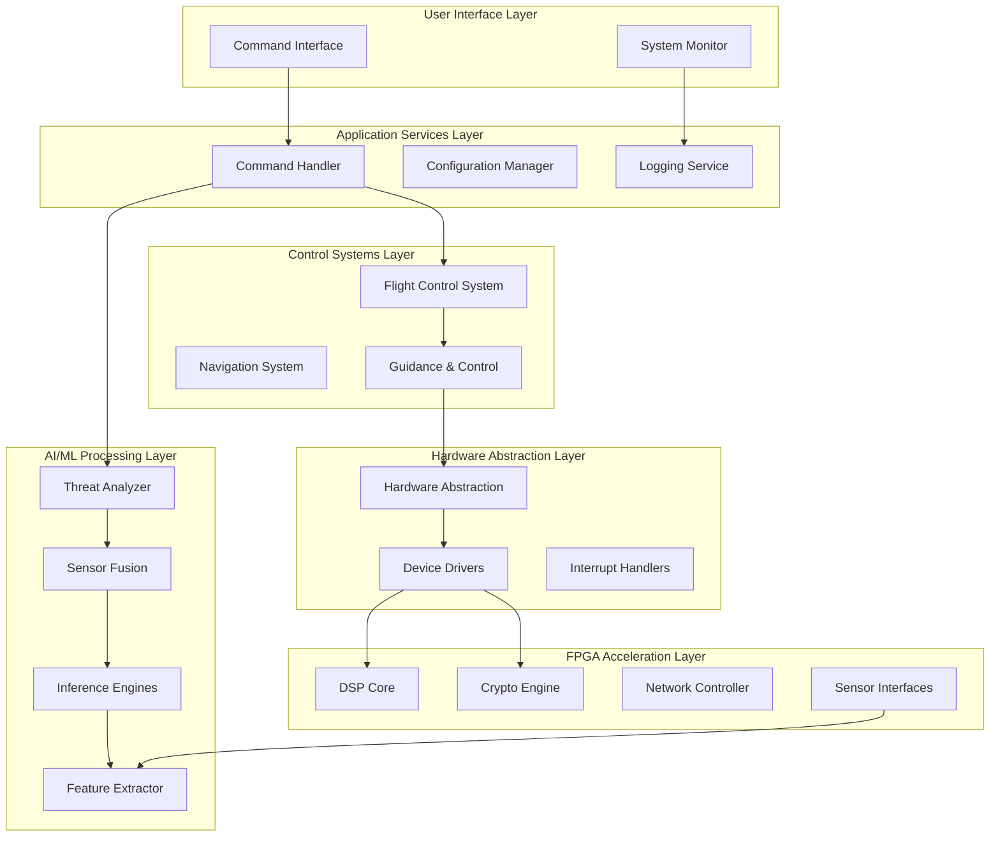
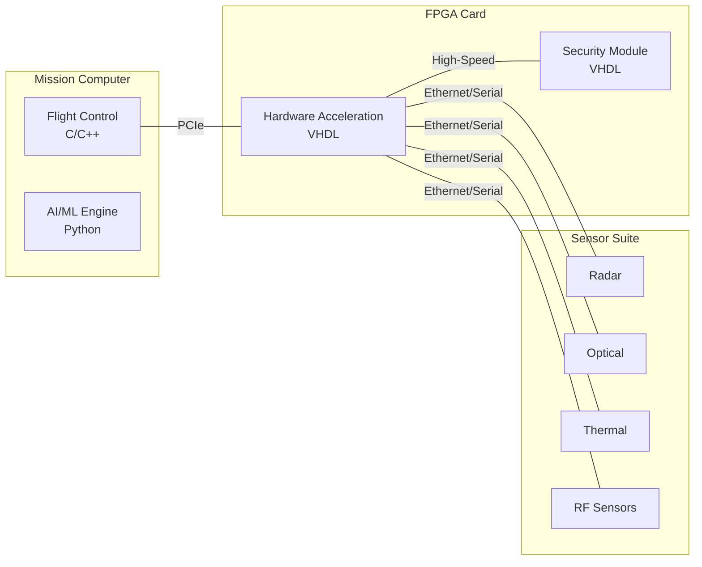
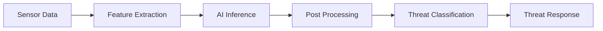
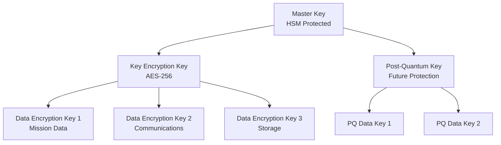

# Software Design Document (SDD)
## AEGIS-SE Defense Platform

**Document ID**: SDD-AEGIS-SE-001
**Version**: 1.0
**Date**: September 26, 2025
**Classification**: UNCLASSIFIED
**Prepared for**: Department of Defense
**Prepared by**: AEGIS-SE Development Team

---

## Document Control

| Version | Date | Author | Description of Changes |
|---------|------|--------|------------------------|
| 1.0 | 2025-09-26 | AEGIS-SE Team | Initial release |

---

## Table of Contents

1. [Introduction](#1-introduction)
2. [Design Overview](#2-design-overview)
3. [System Architecture](#3-system-architecture)
4. [Component Design](#4-component-design)
5. [Interface Design](#5-interface-design)
6. [Data Design](#6-data-design)
7. [Security Design](#7-security-design)
8. [Performance Design](#8-performance-design)

---

## 1. Introduction

### 1.1 Purpose

This Software Design Document (SDD) describes the architectural and detailed design of the AEGIS-SE Defense Platform software components. The design follows DoD-STD-2167A standards and incorporates modern software engineering practices for high-reliability defense systems.

### 1.2 Scope

This document covers the design of all software components including:
- Real-time flight control systems
- AI/ML threat detection and analysis engines
- Multi-sensor data fusion algorithms
- FPGA-based hardware acceleration
- Advanced cryptographic modules
- System integration and interfaces

### 1.3 Design Philosophy

The AEGIS-SE system design is based on the following principles:

1. **Modularity**: Clear separation of concerns with well-defined interfaces
2. **Reliability**: Fault-tolerant design with graceful degradation
3. **Performance**: Real-time operation with deterministic response times
4. **Security**: Defense-in-depth with multiple security layers
5. **Maintainability**: Clean code architecture with comprehensive documentation

---

## 2. Design Overview

### 2.1 Architectural Style

The AEGIS-SE system employs a **layered architectural style** with elements of:
- **Component-based architecture** for modularity
- **Pipeline architecture** for data processing
- **Real-time architecture** for time-critical operations

### 2.2 Design Constraints

| Constraint Type | Description | Impact |
|----------------|-------------|---------|
| Performance | Real-time response requirements | Deterministic algorithms, optimized code |
| Safety | DO-178C Level A compliance | Rigorous testing, formal verification |
| Security | FIPS 140-2 Level 4 compliance | Hardware security modules, encryption |
| Environmental | MIL-STD-810 conditions | Ruggedized hardware, temperature monitoring |

### 2.3 Technology Stack Rationale

| Technology | Purpose | Rationale | Alternatives Considered |
|------------|---------|-----------|-------------------------|
| C/C++ | Flight Control | Real-time performance, DO-178C compliance | Ada, Rust |
| Python 3.9+ | AI/ML Processing | Rich ML ecosystem, rapid development | Java, C++ |
| VHDL-2008 | FPGA Implementation | Hardware description standard, tool support | SystemVerilog, Chisel |
| TensorFlow Lite | AI Inference | Optimized for edge deployment | ONNX Runtime, PyTorch Mobile |
| PostgreSQL | Configuration DB | ACID compliance, reliability | SQLite, MongoDB |

---

## 3. System Architecture

### 3.1 High-Level Architecture



### 3.2 Component Interaction

The system components interact through well-defined interfaces:

1. **Command Flow**: UI → Application Services → Processing Layers
2. **Data Flow**: Sensors → HAL → Processing → Application Services
3. **Control Flow**: Application Services → Control Systems → Hardware

### 3.3 Deployment Architecture



---

## 4. Component Design

### 4.1 Flight Control System Component

**File**: `src/embedded-systems/flight-control/flight_control_system.c`

#### 4.1.1 Component Overview
- **Purpose**: Provide real-time flight control with DO-178C Level A compliance
- **Requirements**: REQ-F-001, REQ-F-002, REQ-NF-P-001
- **Interface**: Real-time control loops, sensor inputs, actuator outputs

#### 4.1.2 Class Structure

```c
// Main control system structure
typedef struct {
    FlightState current_state;
    ControlParameters control_params;
    SensorData sensor_inputs;
    ActuatorCommands actuator_outputs;
    SafetyLimits safety_envelope;
    PerformanceMetrics metrics;
} FlightControlSystem;

// Core control functions
FlightControlResult initialize_flight_control(FlightControlSystem* fcs);
FlightControlResult execute_control_loop(FlightControlSystem* fcs);
FlightControlResult shutdown_flight_control(FlightControlSystem* fcs);
```

#### 4.1.3 Algorithm Design

**Control Loop Algorithm**:
1. Sensor data acquisition and validation
2. State estimation using Kalman filtering
3. Control law computation (PID with feedforward)
4. Safety limit checking and envelope protection
5. Actuator command generation
6. Performance metric update

**Safety Features**:
- Flight envelope protection with 2° angle of attack margin
- Load factor limiting to ±9G operational envelope
- Automatic recovery initiation within 100ms

### 4.2 AI/ML Threat Detection Component

**File**: `src/ai-ml-systems/threat-detection/threat_analyzer.py`

#### 4.2.1 Component Overview
- **Purpose**: Real-time threat detection and classification using AI/ML
- **Requirements**: REQ-F-003, REQ-F-005, REQ-F-006
- **Interface**: Sensor data input, threat classification output

#### 4.2.2 Class Structure

```python
class ThreatAnalyzer:
    """Main threat detection and analysis engine"""

    def __init__(self, config_path: str):
        self.config = self._load_config(config_path)
        self.inference_engines = self._initialize_engines()
        self.feature_extractor = FeatureExtractor()
        self.threat_buffer = ThreatBuffer(max_size=1000)

    def analyze_threats(self, sensor_data: Dict) -> List[ThreatDetection]:
        """Main threat analysis pipeline"""
        # REQ-F-003: Multi-sensor threat detection
        features = self.feature_extractor.extract(sensor_data)
        threats = self._classify_threats(features)
        return self._post_process_threats(threats)
```

#### 4.2.3 Processing Pipeline



### 4.3 Sensor Fusion Component

**File**: `src/ai-ml-systems/sensor-fusion/sensor_fusion.py`

#### 4.3.1 Component Overview
- **Purpose**: Fuse multi-sensor data for improved accuracy
- **Requirements**: REQ-F-004, REQ-NF-P-002
- **Interface**: Multiple sensor inputs, fused track output

#### 4.3.2 Class Structure

```python
class SensorFusion:
    """Multi-sensor data fusion using Kalman filtering"""

    def __init__(self):
        self.trackers = {}  # Track ID -> KalmanFilter
        self.sensor_configs = self._load_sensor_configs()

    def process_sensor_data(self, sensor_id: str, detections: List) -> List[Track]:
        """REQ-F-004: Sensor data fusion"""
        # Kalman filter prediction and update
        # Track association using Mahalanobis distance
        # Multi-sensor correlation and fusion
```

### 4.4 Cryptographic Security Component

**File**: `src/fpga-designs/cryptography/hardware_security_module.vhd`

#### 4.4.1 Component Overview
- **Purpose**: Hardware-based security with tamper detection
- **Requirements**: REQ-F-007, REQ-S-001, REQ-S-002
- **Interface**: Cryptographic operations, key management, tamper monitoring

#### 4.4.2 VHDL Entity Structure

```vhdl
entity hardware_security_module is
    Generic (
        KEY_STORAGE_SIZE   : integer := 4096;
        TAMPER_SENSORS     : integer := 8;
        CLOCK_FREQ_MHZ     : integer := 200
    );
    Port (
        -- Control Interface
        clk                 : in  STD_LOGIC;
        rst_n               : in  STD_LOGIC;

        -- Security Interface
        tamper_sensors      : in  STD_LOGIC_VECTOR(TAMPER_SENSORS-1 downto 0);
        security_state      : out STD_LOGIC_VECTOR(3 downto 0);
        tamper_detected     : out STD_LOGIC;

        -- Key Management Interface
        key_request         : in  STD_LOGIC;
        key_data            : out STD_LOGIC_VECTOR(255 downto 0);
        key_valid           : out STD_LOGIC
    );
end hardware_security_module;
```

---

## 5. Interface Design

### 5.1 Internal Interfaces

#### 5.1.1 Flight Control to AI/ML Interface

```c
// Interface structure for flight control to AI/ML communication
typedef struct {
    uint32_t timestamp_us;
    FlightState aircraft_state;
    ThreatLevel current_threat_level;
    EngagementStatus engagement_status;
} FlightControlToAIInterface;
```

#### 5.1.2 AI/ML to Sensor Fusion Interface

```python
@dataclass
class SensorDataPacket:
    """Standard sensor data interface"""
    sensor_id: str
    timestamp: float
    data_type: SensorType
    raw_data: np.ndarray
    metadata: Dict[str, Any]
```

### 5.2 External Interfaces

#### 5.2.1 C4ISR Integration Interface

```python
class C4ISRInterface:
    """Interface to Command, Control, Communications systems"""

    def send_tactical_data(self, link16_message: Link16Message):
        """REQ-I-001: C4ISR Integration"""
        # Implement Link 16 tactical data link protocol

    def receive_orders(self) -> CommandMessage:
        """Receive mission orders from higher command"""
        # Implement command reception protocol
```

#### 5.2.2 Hardware Interface Layer

```c
// Hardware abstraction layer interface
typedef struct {
    uint32_t (*read_sensor)(uint8_t sensor_id, uint8_t* buffer, uint32_t size);
    uint32_t (*write_actuator)(uint8_t actuator_id, uint8_t* data, uint32_t size);
    uint32_t (*configure_fpga)(uint32_t config_word);
} HardwareInterface;
```

---

## 6. Data Design

### 6.1 Data Architecture

The system uses a multi-tiered data architecture:

1. **Real-time Data**: In-memory buffers for sensor data and control commands
2. **Configuration Data**: File-based and database storage for system parameters
3. **Historical Data**: Compressed storage for mission replay and analysis
4. **Security Data**: Hardware-protected key storage and audit logs

### 6.2 Data Structures

#### 6.2.1 Flight Control Data

```c
// Primary flight control data structure
typedef struct {
    // State vector (position, velocity, attitude)
    Vector3D position;          // meters (NED frame)
    Vector3D velocity;          // m/s (NED frame)
    Quaternion attitude;        // unit quaternion
    Vector3D angular_velocity;  // rad/s (body frame)

    // Control inputs
    ControlSurfaceCommands control_surfaces;
    ThrustCommands thrust_commands;

    // Safety status
    FlightEnvelopeStatus envelope_status;
    SystemHealthStatus system_health;
} FlightControlData;
```

#### 6.2.2 Threat Detection Data

```python
@dataclass
class ThreatDetection:
    """Standardized threat detection data structure"""
    threat_id: str
    classification: ThreatType
    confidence: float  # 0.0 to 1.0
    position: Tuple[float, float, float]  # x, y, z in NED
    velocity: Tuple[float, float, float]  # vx, vy, vz in NED
    threat_level: ThreatLevel
    timestamp: datetime
    sensor_sources: List[str]
```

### 6.3 Database Design

#### 6.3.1 Configuration Database Schema

```sql
-- System configuration table
CREATE TABLE system_config (
    id SERIAL PRIMARY KEY,
    component VARCHAR(50) NOT NULL,
    parameter VARCHAR(100) NOT NULL,
    value TEXT NOT NULL,
    data_type VARCHAR(20) NOT NULL,
    description TEXT,
    created_at TIMESTAMP DEFAULT CURRENT_TIMESTAMP,
    updated_at TIMESTAMP DEFAULT CURRENT_TIMESTAMP
);

-- Mission parameters table
CREATE TABLE mission_parameters (
    mission_id UUID PRIMARY KEY,
    start_time TIMESTAMP NOT NULL,
    end_time TIMESTAMP,
    mission_type VARCHAR(50) NOT NULL,
    parameters JSONB NOT NULL,
    status VARCHAR(20) DEFAULT 'ACTIVE'
);
```

---

## 7. Security Design

### 7.1 Security Architecture

The security design implements defense-in-depth with multiple layers:

1. **Physical Security**: Tamper detection and response
2. **Hardware Security**: Hardware Security Module (HSM)
3. **Cryptographic Security**: AES-256 and post-quantum algorithms
4. **Network Security**: Encrypted communications
5. **Application Security**: Access control and audit logging

### 7.2 Cryptographic Design

#### 7.2.1 Encryption Hierarchy



#### 7.2.2 Key Management Design

```vhdl
-- Key management state machine
type key_mgmt_state_type is (
    INIT,
    AUTHENTICATE,
    KEY_GENERATION,
    KEY_DISTRIBUTION,
    KEY_ROTATION,
    KEY_DESTRUCTION,
    ERROR_STATE
);
```

### 7.3 Tamper Detection Design

The HSM implements multi-layer tamper detection:

- **Physical Layer**: Mesh circuits, case switches, environmental sensors
- **Logical Layer**: Memory integrity checks, execution flow monitoring
- **Temporal Layer**: Timing attack detection, performance monitoring

---

## 8. Performance Design

### 8.1 Performance Requirements Analysis

| Component | Requirement | Design Solution | Validation Method |
|-----------|-------------|-----------------|-------------------|
| Flight Control | 1ms response | Real-time OS, optimized algorithms | Hardware-in-loop testing |
| Threat Detection | 50ms latency | Hardware acceleration, parallel processing | Performance profiling |
| AI Inference | 15ms latency | TensorFlow Lite optimization, GPU acceleration | Benchmarking |
| Crypto Processing | 10 Gbps throughput | FPGA parallel engines, pipeline architecture | Throughput testing |

### 8.2 Real-Time Design

#### 8.2.1 Task Scheduling

```c
// Real-time task priorities (higher number = higher priority)
#define FLIGHT_CONTROL_PRIORITY     99
#define SENSOR_PROCESSING_PRIORITY  90
#define THREAT_DETECTION_PRIORITY   80
#define COMMUNICATION_PRIORITY      70
#define LOGGING_PRIORITY           10
```

#### 8.2.2 Memory Management

```c
// Pre-allocated memory pools for deterministic allocation
typedef struct {
    void* sensor_data_pool;
    void* control_data_pool;
    void* threat_data_pool;
    size_t pool_sizes[3];
} MemoryPools;
```

### 8.3 FPGA Performance Design

#### 8.3.1 Pipeline Architecture

The FPGA implements deep pipeline architectures for maximum throughput:

- **AES Pipeline**: 16 stages for 500 MHz operation
- **DSP Pipeline**: 8 stages for signal processing
- **Network Pipeline**: 4 stages for packet processing

#### 8.3.2 Parallel Processing

```vhdl
-- Generate multiple parallel processing engines
generate_engines: for i in 0 to NUM_PARALLEL_ENGINES-1 generate
    engine_inst: processing_engine
        port map (
            clk => clk,
            rst_n => rst_n,
            data_in => engine_data_in(i),
            data_out => engine_data_out(i)
        );
end generate;
```

---

## 9. Design Verification

### 9.1 Design Review Process

1. **Preliminary Design Review (PDR)**: Architecture and high-level design
2. **Critical Design Review (CDR)**: Detailed design and implementation plan
3. **Test Readiness Review (TRR)**: Test procedures and acceptance criteria

### 9.2 Design Validation Methods

| Design Element | Validation Method | Success Criteria |
|----------------|-------------------|------------------|
| Architecture | Static analysis, design walkthroughs | Requirements traceability |
| Algorithms | Mathematical proof, simulation | Performance targets met |
| Interfaces | Integration testing | Protocol compliance |
| Security | Penetration testing, formal verification | No vulnerabilities found |

---

## Appendix A: Design Patterns Used

| Pattern | Application | Benefit |
|---------|-------------|---------|
| Observer | Event notification system | Loose coupling |
| Command | Control system operations | Undo/redo capability |
| State Machine | System mode management | Clear behavior definition |
| Factory | Component instantiation | Flexible object creation |
| Singleton | System-wide resources | Controlled access |

## Appendix B: Coding Standards Reference

- **C/C++**: MISRA C:2012 for safety-critical code
- **Python**: PEP 8 with additional security guidelines
- **VHDL**: IEEE 1076-2008 with custom naming conventions

---

**End of Document**
