# AEGIS-SE System Architecture Diagrams
## Defense Platform Technical Documentation

**Document ID**: DIAG-ARCH-AEGIS-SE-001
**Version**: 1.0
**Date**: September 26, 2025
**Classification**: UNCLASSIFIED
**Prepared for**: Department of Defense
**Prepared by**: AEGIS-SE Development Team

---

## Table of Contents

1. [System Overview](#1-system-overview)
2. [Component Architecture](#2-component-architecture)
3. [Data Flow Diagrams](#3-data-flow-diagrams)
4. [Sequence Diagrams](#4-sequence-diagrams)
5. [Deployment Architecture](#5-deployment-architecture)
6. [Security Architecture](#6-security-architecture)

---

## 1. System Overview

### 1.1 High-Level System Architecture

```mermaid
graph TB
    subgraph "External Interfaces"
        C4ISR[C4ISR Systems]
        SENSORS[Sensor Suite]
        ACTUATORS[Control Actuators]
        COMM[Communication Links]
    end

    subgraph "AEGIS-SE Platform"
        subgraph "Application Layer"
            UI[User Interface]
            CMD[Command Processor]
            MON[System Monitor]
        end

        subgraph "Mission Systems"
            FC[Flight Control]
            AI[AI/ML Engine]
            NAV[Navigation]
            THREAT[Threat Detection]
        end

        subgraph "Core Services"
            CONFIG[Configuration Mgmt]
            LOG[Logging Service]
            SEC[Security Manager]
            COMM_MGR[Communication Mgr]
        end

        subgraph "Hardware Abstraction"
            HAL[Hardware Abstraction Layer]
            DRIVERS[Device Drivers]
            FPGA[FPGA Acceleration]
        end
    end

    C4ISR <--> COMM_MGR
    SENSORS --> HAL
    ACTUATORS <-- HAL
    COMM <--> COMM_MGR

    UI --> CMD
    CMD --> FC
    CMD --> AI
    MON --> LOG

    FC --> HAL
    AI --> THREAT
    NAV --> FC
    THREAT --> SEC

    CONFIG --> CMD
    LOG --> SEC
    SEC --> FPGA
    COMM_MGR --> SEC

    HAL --> DRIVERS
    DRIVERS --> FPGA
```

### 1.2 System Boundaries and Interfaces

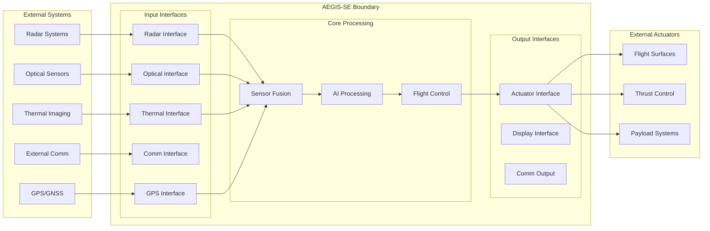

---

## 2. Component Architecture

### 2.1 Flight Control System Architecture

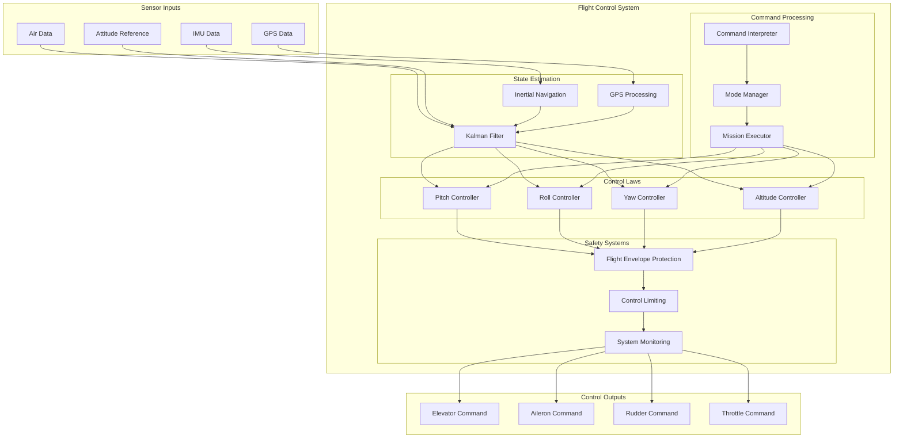

### 2.2 AI/ML System Architecture

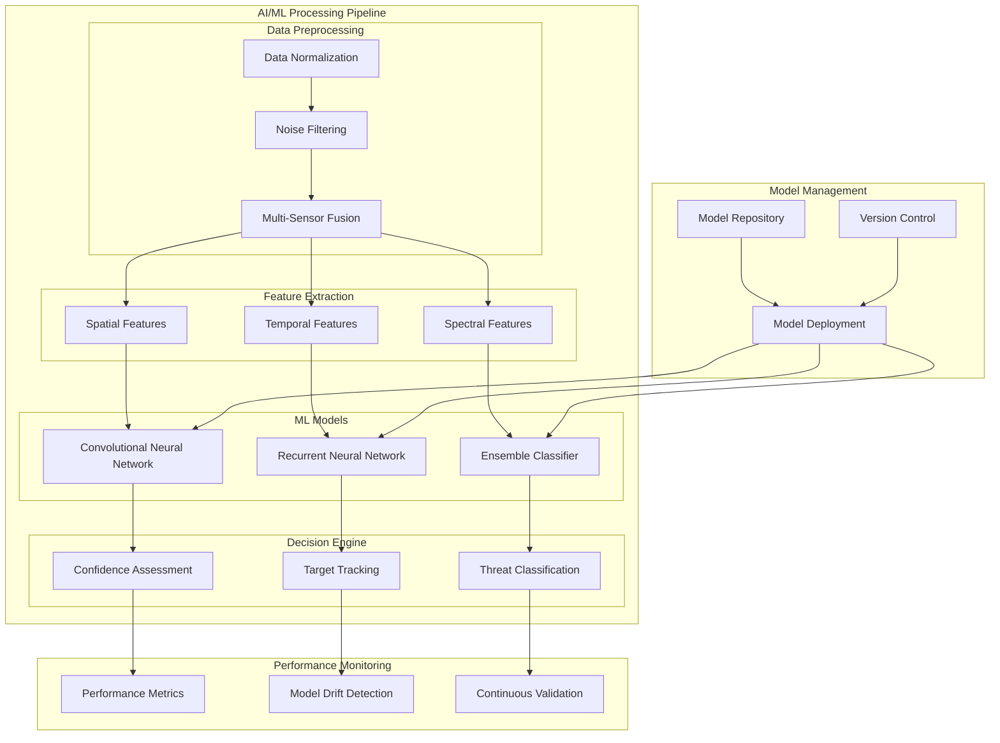

### 2.3 FPGA Hardware Architecture

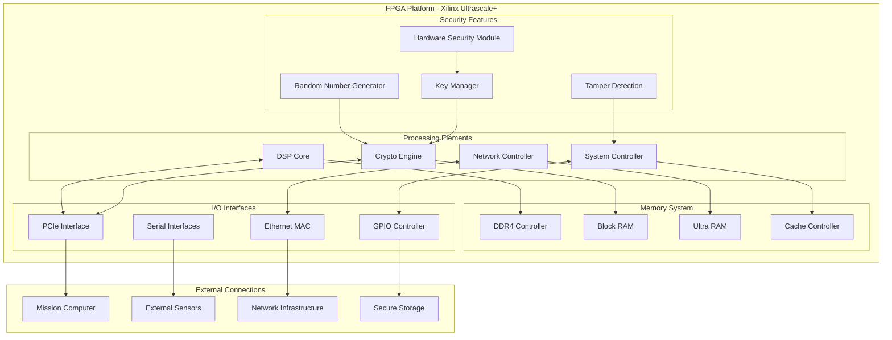

---

## 3. Data Flow Diagrams

### 3.1 Sensor Data Processing Flow

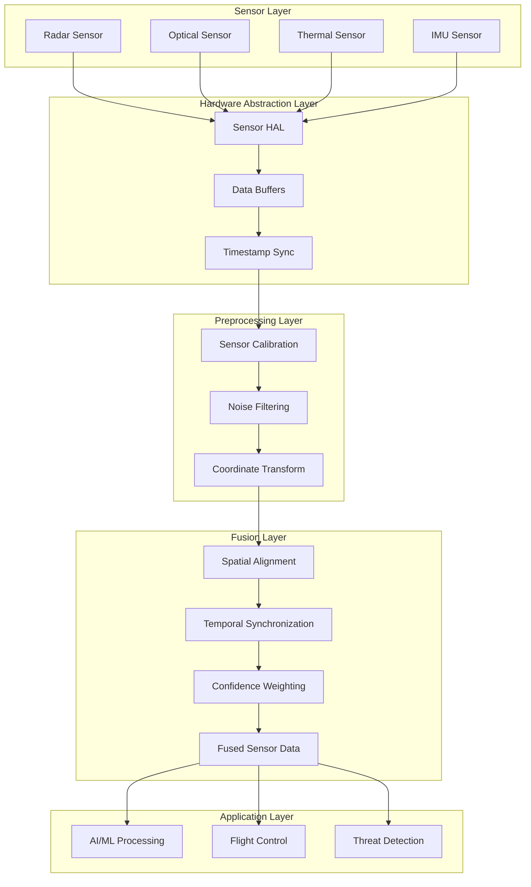

### 3.2 Command and Control Data Flow

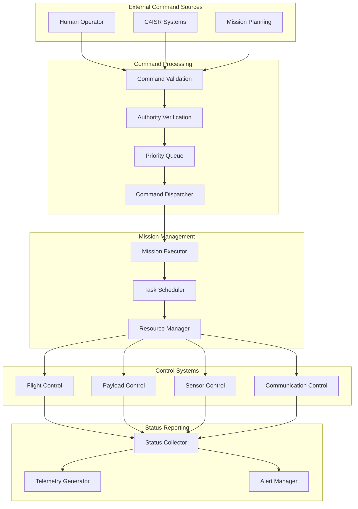

---

## 4. Sequence Diagrams

### 4.1 Threat Detection Sequence

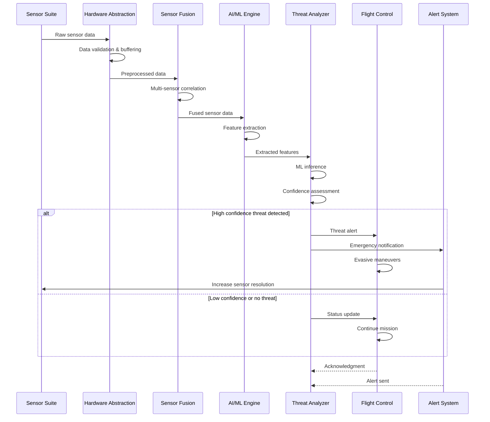

### 4.2 Mission Command Execution Sequence

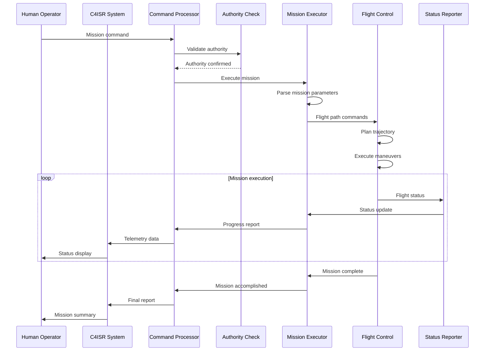

### 4.3 Security Key Management Sequence

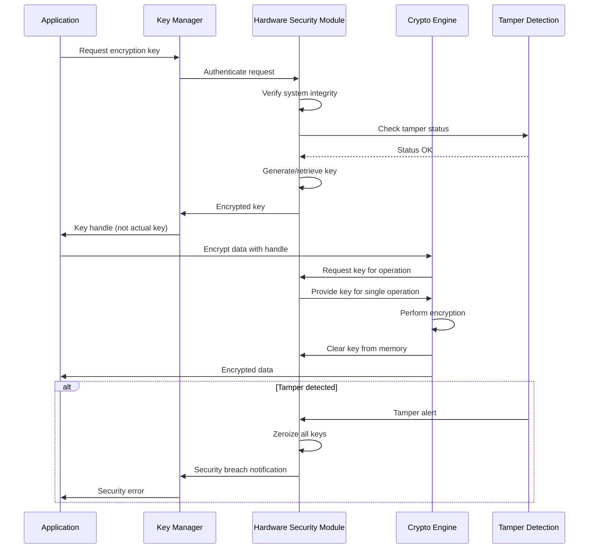

---

## 5. Deployment Architecture

### 5.1 Physical Deployment View

```mermaid
graph TB
    subgraph "Mission Computer Rack"
        subgraph "Primary Mission Computer"
            CPU1[Intel Core i7-12700K]
            RAM1[32GB DDR4 ECC]
            SSD1[1TB NVMe SSD]
            GPU1[NVIDIA RTX 4090]
        end

        subgraph "Backup Mission Computer"
            CPU2[Intel Core i7-12700K]
            RAM2[32GB DDR4 ECC]
            SSD2[1TB NVMe SSD]
            GPU2[NVIDIA RTX 4090]
        end

        subgraph "FPGA Acceleration Card"
            FPGA_CHIP[Xilinx Ultrascale+ XCKU115]
            FPGA_RAM[8GB HBM2]
            FPGA_FLASH[256MB Configuration Flash]
        end
    end

    subgraph "Sensor Suite"
        RADAR_ANT[Radar Antenna Array]
        OPT_CAMERA[Optical Camera System]
        THERMAL_CAM[Thermal Imaging System]
        IMU_UNIT[Inertial Measurement Unit]
    end

    subgraph "Communication Systems"
        RADIO_UHF[UHF Radio]
        RADIO_VHF[VHF Radio]
        DATALINK[Tactical Data Link]
        GPS_ANT[GPS Antenna]
    end

    subgraph "Control Actuators"
        SERVO_ELEV[Elevator Servo]
        SERVO_AIL[Aileron Servo]
        SERVO_RUD[Rudder Servo]
        THROTTLE_CTRL[Throttle Control]
    end

    CPU1 <--> FPGA_CHIP
    CPU2 <--> FPGA_CHIP
    FPGA_CHIP <--> RADAR_ANT
    FPGA_CHIP <--> OPT_CAMERA
    FPGA_CHIP <--> THERMAL_CAM

    CPU1 <--> IMU_UNIT
    CPU1 <--> RADIO_UHF
    CPU1 <--> RADIO_VHF
    CPU1 <--> DATALINK

    CPU1 <--> SERVO_ELEV
    CPU1 <--> SERVO_AIL
    CPU1 <--> SERVO_RUD
    CPU1 <--> THROTTLE_CTRL
```

### 5.2 Network Deployment Architecture

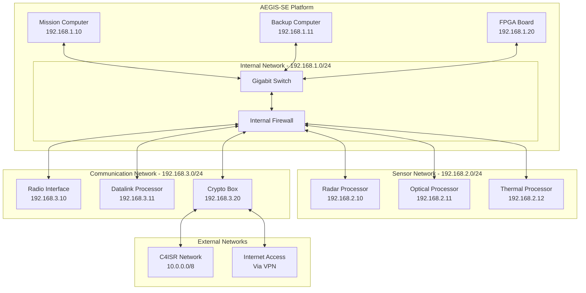

---

## 6. Security Architecture

### 6.1 Defense-in-Depth Security Model

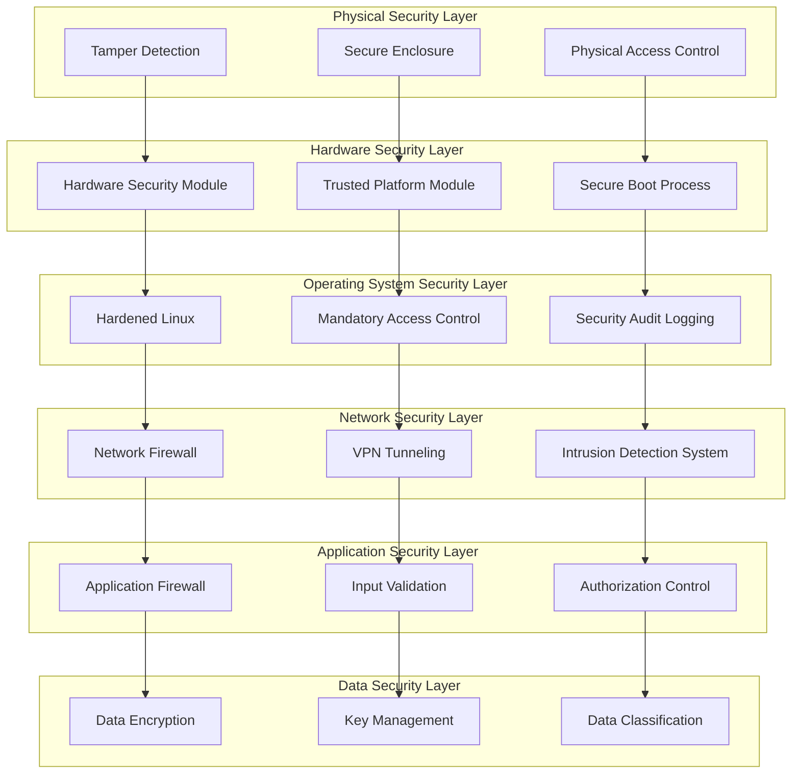

### 6.2 Cryptographic Architecture

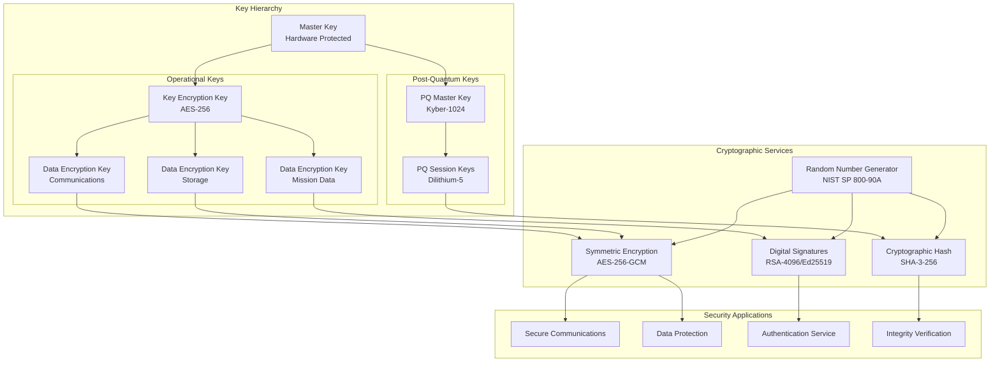

---

## Appendix A: Component Interface Specifications

### A.1 Flight Control Interface Specification

```c
/**
 * @brief Flight Control System Interface Definition
 * @file flight_control_interface.h
 * @version 2.1.0
 */

typedef struct {
    double timestamp_sec;           // System timestamp
    Vector3D position_ned_m;        // Position in NED frame (meters)
    Vector3D velocity_ned_mps;      // Velocity in NED frame (m/s)
    Quaternion attitude_quat;       // Attitude quaternion
    Vector3D angular_rate_rps;      // Angular rates (rad/s)
} FlightState;

typedef struct {
    double elevator_cmd_deg;        // Elevator command (-30 to +30 degrees)
    double aileron_cmd_deg;         // Aileron command (-30 to +30 degrees)
    double rudder_cmd_deg;          // Rudder command (-30 to +30 degrees)
    double throttle_cmd_pct;        // Throttle command (0 to 100 percent)
} ControlCommands;

/**
 * @brief Main flight control interface function
 * @param current_state Current aircraft state
 * @param desired_state Desired aircraft state
 * @param commands Output control commands
 * @return FC_SUCCESS on success, error code on failure
 */
FlightControlResult execute_flight_control(
    const FlightState* current_state,
    const FlightState* desired_state,
    ControlCommands* commands
);
```

### A.2 AI/ML Interface Specification

```python
"""
AI/ML System Interface Specification
Version: 1.0.0
"""

from dataclasses import dataclass
from typing import Dict, List, Optional
import numpy as np

@dataclass
class SensorInput:
    """Standardized sensor input format"""
    sensor_id: str
    timestamp: float
    data_type: str
    raw_data: np.ndarray
    metadata: Dict[str, Any]

@dataclass
class ThreatOutput:
    """Standardized threat detection output"""
    threat_id: str
    classification: str
    confidence: float
    position: Tuple[float, float, float]
    velocity: Tuple[float, float, float]
    threat_level: int

class AIMLInterface:
    """Main AI/ML system interface"""

    def process_sensor_data(self, inputs: List[SensorInput]) -> List[ThreatOutput]:
        """
        Process sensor data and return threat detections

        Args:
            inputs: List of sensor data inputs

        Returns:
            List of threat detections

        Raises:
            ProcessingError: If processing fails
        """
        pass

    def update_models(self, model_path: str) -> bool:
        """
        Update AI/ML models

        Args:
            model_path: Path to new model files

        Returns:
            True if update successful, False otherwise
        """
        pass
```

---

## Appendix B: Performance Specifications

### B.1 Real-Time Performance Requirements

| Subsystem | Function | Response Time | Throughput | Availability |
|-----------|----------|---------------|------------|--------------|
| Flight Control | Control loop execution | < 1 ms | 1000 Hz | 99.999% |
| Threat Detection | AI inference | < 15 ms | 100 detections/sec | 99.99% |
| Sensor Fusion | Data correlation | < 5 ms | 10 GB/sec | 99.99% |
| Communication | Message handling | < 10 ms | 1 Gbps | 99.9% |
| FPGA Acceleration | Crypto operations | < 1 µs | 10 Gbps | 99.999% |

### B.2 Resource Utilization Targets

| Resource | Target Utilization | Maximum Utilization |
|----------|-------------------|-------------------|
| CPU (Mission Computer) | < 70% | < 85% |
| Memory (System RAM) | < 80% | < 90% |
| FPGA Logic Resources | < 75% | < 85% |
| Network Bandwidth | < 60% | < 80% |
| Storage I/O | < 50% | < 70% |

---

**Document Status**: Complete
**Last Updated**: 2025-09-26
**Next Review**: 2026-03-26
