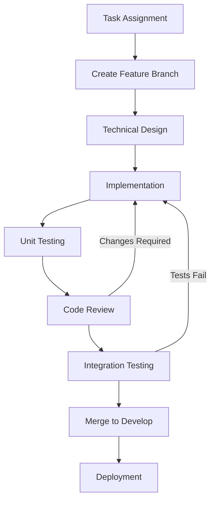

# Development Procedures Manual
## AEGIS-SE Defense Platform

**Document ID**: PROC-DEV-AEGIS-SE-001
**Version**: 1.0
**Date**: September 26, 2025
**Classification**: UNCLASSIFIED
**Prepared for**: Department of Defense
**Prepared by**: AEGIS-SE Development Team

---

## Table of Contents

1. [Introduction](#1-introduction)
2. [Development Workflow](#2-development-workflow)
3. [Coding Standards](#3-coding-standards)
4. [Code Review Process](#4-code-review-process)
5. [Testing Procedures](#5-testing-procedures)
6. [Documentation Standards](#6-documentation-standards)
7. [Quality Assurance](#7-quality-assurance)
8. [Security Procedures](#8-security-procedures)

---

## 1. Introduction

### 1.1 Purpose

This Development Procedures Manual establishes standardized development practices for the AEGIS-SE Defense Platform, ensuring consistency, quality, and compliance with DO-178C Level A and DoD-STD-2167A requirements.

### 1.2 Scope

These procedures apply to all software development activities including:

- Feature development and enhancement
- Bug fixes and maintenance
- Code reviews and quality assurance
- Testing and validation
- Documentation and technical writing

---

## 2. Development Workflow

### 2.1 Standard Development Process



### 2.2 Branch Management

#### 2.2.1 Branch Creation

```bash
#!/bin/bash
# Create new feature branch

# Step 1: Ensure main branch is up to date
git checkout main
git pull origin main

# Step 2: Create feature branch with standard naming
FEATURE_NAME="ai-threat-detection-enhancement"
BRANCH_NAME="feature/${FEATURE_NAME}"

git checkout -b "${BRANCH_NAME}"
git push -u origin "${BRANCH_NAME}"

echo "Created feature branch: ${BRANCH_NAME}"
```

#### 2.2.2 Daily Development Routine

```bash
#!/bin/bash
# Daily development routine

echo "Starting daily development routine..."

# Update local repository
git fetch origin
git rebase origin/develop

# Run pre-development checks
echo "Running code quality checks..."
pre-commit run --all-files

# Run unit tests
echo "Running unit tests..."
python -m pytest tests/unit/ -v --cov=src

# Check for security vulnerabilities
echo "Running security scan..."
bandit -r src/ -f json -o security-report.json

echo "Development environment ready"
```

### 2.3 Task Management

#### 2.3.1 Work Item Lifecycle

| Status | Description | Required Actions |
|--------|-------------|------------------|
| **To Do** | Task assigned, not started | Review requirements, plan approach |
| **In Progress** | Active development | Daily commits, update status |
| **Code Review** | Implementation complete | Create pull request, address feedback |
| **Testing** | Code approved | Run integration tests, verify functionality |
| **Done** | Task completed | Merge to develop, update documentation |

#### 2.3.2 Time Tracking

```python
class TaskTracker:
    """Track development time and progress for DoD reporting requirements"""

    def __init__(self, task_id: str, developer: str):
        self.task_id = task_id
        self.developer = developer
        self.start_time = None
        self.end_time = None
        self.time_logs = []

    def start_work(self):
        """Begin work session"""
        self.start_time = datetime.now()
        print(f"Starting work on task {self.task_id} at {self.start_time}")

    def end_work(self, completion_notes: str = ""):
        """End work session with notes"""
        self.end_time = datetime.now()
        session_duration = self.end_time - self.start_time

        self.time_logs.append({
            'start': self.start_time,
            'end': self.end_time,
            'duration': session_duration,
            'notes': completion_notes
        })

        self._update_project_tracking()
```

---

## 3. Coding Standards

### 3.1 Language-Specific Standards

#### 3.1.1 C/C++ Standards (MISRA C:2012)

```c
/**
 * @file flight_control_system.c
 * @brief Flight control system implementation
 * @author Flight Control Team
 * @date 2025-09-26
 * @classification UNCLASSIFIED
 */

#include "flight_control_system.h"

// MISRA C:2012 Rule 8.7: Objects shall be defined at block scope
static FlightControlState g_flight_state;

/**
 * @brief Initialize flight control system
 * @param[in] config Pointer to configuration structure
 * @return FC_SUCCESS on success, error code otherwise
 * @pre config != NULL
 * @post Flight control system is initialized
 */
FlightControlResult initialize_flight_control(const FlightControlConfig* config)
{
    // MISRA C:2012 Rule 1.3: No undefined behavior
    if (config == NULL) {
        return FC_ERROR_NULL_POINTER;
    }

    // MISRA C:2012 Rule 9.1: No uninitialized variables
    g_flight_state.position.x = 0.0F;
    g_flight_state.position.y = 0.0F;
    g_flight_state.position.z = 0.0F;

    // MISRA C:2012 Rule 10.3: No implicit conversions
    g_flight_state.max_g_force = (float64_t)config->safety_limits.max_g;

    return FC_SUCCESS;
}
```

#### 3.1.2 Python Standards (PEP 8 + DoD Extensions)

```python
"""
AEGIS-SE Threat Detection Module

This module provides real-time threat detection and classification
capabilities for the AEGIS-SE defense platform.

Author: AI/ML Team
Date: 2025-09-26
Classification: UNCLASSIFIED
"""

import logging
import numpy as np
from typing import Dict, List, Optional, Tuple
from dataclasses import dataclass
from enum import Enum


class ThreatLevel(Enum):
    """Threat classification levels per DoD standards."""

    UNKNOWN = 0
    LOW = 1
    MEDIUM = 2
    HIGH = 3
    CRITICAL = 4


@dataclass
class ThreatDetection:
    """
    Standardized threat detection data structure.

    Attributes:
        threat_id: Unique identifier for the threat
        classification: Threat type classification
        confidence: Detection confidence (0.0 to 1.0)
        position: 3D position in NED coordinates (meters)
        velocity: 3D velocity in NED coordinates (m/s)
        threat_level: Assessed threat level
        timestamp: Detection timestamp
    """

    threat_id: str
    classification: str
    confidence: float
    position: Tuple[float, float, float]
    velocity: Tuple[float, float, float]
    threat_level: ThreatLevel
    timestamp: float


class ThreatAnalyzer:
    """
    Main threat detection and analysis engine.

    This class implements the core threat detection algorithms
    using AI/ML models for real-time threat assessment.
    """

    def __init__(self, config_path: str) -> None:
        """
        Initialize threat analyzer.

        Args:
            config_path: Path to configuration file

        Raises:
            ConfigurationError: If config file is invalid
            ModelLoadError: If AI models cannot be loaded
        """
        self._config = self._load_configuration(config_path)
        self._models = self._initialize_models()
        self._logger = logging.getLogger(__name__)

        # Initialize threat tracking buffers
        self._active_threats: Dict[str, ThreatDetection] = {}
        self._threat_history: List[ThreatDetection] = []

    def analyze_threats(self, sensor_data: Dict[str, np.ndarray]) -> List[ThreatDetection]:
        """
        Analyze sensor data for threats.

        Args:
            sensor_data: Dictionary of sensor readings

        Returns:
            List of detected threats

        Raises:
            SensorDataError: If sensor data is invalid
            AnalysisError: If threat analysis fails
        """
        try:
            # Validate input data
            self._validate_sensor_data(sensor_data)

            # Extract features from sensor data
            features = self._extract_features(sensor_data)

            # Run AI/ML inference
            threat_predictions = self._run_inference(features)

            # Post-process predictions
            threats = self._post_process_predictions(threat_predictions)

            # Update threat tracking
            self._update_threat_tracking(threats)

            return threats

        except Exception as e:
            self._logger.error(f"Threat analysis failed: {e}")
            raise AnalysisError(f"Threat analysis failed: {e}") from e
```

#### 3.1.3 VHDL Standards (IEEE 1076-2008)

```vhdl
--------------------------------------------------------------------------------
-- Title      : Advanced Encryption Standard (AES) Crypto Accelerator
-- Project    : AEGIS-SE Defense Platform
-- File       : aes_crypto_accelerator.vhd
-- Author     : FPGA Team
-- Company    : AEGIS-SE Development Team
-- Created    : 2025-09-26
-- Platform   : Xilinx Ultrascale+
-- Standard   : VHDL-2008
-- Classification : UNCLASSIFIED
--------------------------------------------------------------------------------
-- Description: Hardware implementation of AES-256 encryption with side-channel
--              protection and fault detection capabilities.
--------------------------------------------------------------------------------

library IEEE;
use IEEE.STD_LOGIC_1164.ALL;
use IEEE.NUMERIC_STD.ALL;

-- Custom library for AEGIS-SE common types
library AEGIS_LIB;
use AEGIS_LIB.AEGIS_TYPES.ALL;

entity aes_crypto_accelerator is
    Generic (
        -- Configuration parameters with clear documentation
        KEY_SIZE_BITS      : positive := 256;  -- AES-256 key size
        BLOCK_SIZE_BITS    : positive := 128;  -- AES block size
        PIPELINE_STAGES    : positive := 16;   -- Pipeline depth for throughput
        CLOCK_FREQ_MHZ     : positive := 200;  -- Operating frequency
        ENABLE_SIDE_CHANNEL_PROTECTION : boolean := true  -- Security feature enable
    );
    Port (
        -- Clock and reset (active low reset per AEGIS standard)
        clk                 : in  STD_LOGIC;
        rst_n               : in  STD_LOGIC;

        -- Control interface with clear signal names
        encrypt_enable      : in  STD_LOGIC;
        decrypt_enable      : in  STD_LOGIC;
        operation_mode      : in  STD_LOGIC_VECTOR(2 downto 0);  -- ECB, CBC, GCM

        -- Data interfaces with proper bit widths
        plaintext_data      : in  STD_LOGIC_VECTOR(BLOCK_SIZE_BITS-1 downto 0);
        ciphertext_data     : out STD_LOGIC_VECTOR(BLOCK_SIZE_BITS-1 downto 0);

        -- Key management interface
        encryption_key      : in  STD_LOGIC_VECTOR(KEY_SIZE_BITS-1 downto 0);
        key_valid           : in  STD_LOGIC;

        -- Status and control
        operation_complete  : out STD_LOGIC;
        error_detected      : out STD_LOGIC;
        ready_for_data      : out STD_LOGIC
    );
end aes_crypto_accelerator;

architecture behavioral of aes_crypto_accelerator is

    -- Type definitions for better code readability
    type state_array_type is array (0 to 3, 0 to 3) of STD_LOGIC_VECTOR(7 downto 0);
    type round_key_array_type is array (0 to 14) of STD_LOGIC_VECTOR(KEY_SIZE_BITS-1 downto 0);

    -- Internal signals with descriptive names
    signal current_state        : state_array_type;
    signal round_keys          : round_key_array_type;
    signal current_round       : unsigned(3 downto 0);
    signal operation_state     : aes_operation_state_type;

    -- Security-related signals
    signal side_channel_mask   : STD_LOGIC_VECTOR(31 downto 0);
    signal fault_injection_detect : STD_LOGIC;

begin

    -- Main AES encryption/decryption process
    aes_main_process: process(clk, rst_n)
    begin
        if rst_n = '0' then
            -- Secure reset - clear all sensitive data
            current_state <= (others => (others => (others => '0')));
            round_keys <= (others => (others => '0'));
            current_round <= (others => '0');
            operation_state <= AES_IDLE;

        elsif rising_edge(clk) then

            case operation_state is

                when AES_IDLE =>
                    if encrypt_enable = '1' or decrypt_enable = '1' then
                        operation_state <= AES_KEY_EXPANSION;
                        current_round <= (others => '0');
                    end if;

                when AES_KEY_EXPANSION =>
                    -- Implement key expansion algorithm
                    if key_expansion_complete = '1' then
                        operation_state <= AES_PROCESSING;
                    end if;

                when AES_PROCESSING =>
                    -- Main AES rounds implementation
                    if current_round = to_unsigned(14, 4) then
                        operation_state <= AES_COMPLETE;
                    else
                        current_round <= current_round + 1;
                    end if;

                when AES_COMPLETE =>
                    operation_complete <= '1';
                    operation_state <= AES_IDLE;

                when others =>
                    -- Error state - should never occur in normal operation
                    error_detected <= '1';
                    operation_state <= AES_IDLE;

            end case;

        end if;
    end process aes_main_process;

    -- Side-channel protection process (when enabled)
    side_channel_protection: if ENABLE_SIDE_CHANNEL_PROTECTION generate

        protection_process: process(clk, rst_n)
        begin
            if rst_n = '0' then
                side_channel_mask <= (others => '0');
            elsif rising_edge(clk) then
                -- Implement masking and randomization
                side_channel_mask <= generate_random_mask(side_channel_mask);
            end if;
        end process protection_process;

    end generate side_channel_protection;

end behavioral;
```

### 3.2 Documentation Standards

#### 3.2.1 Function Documentation

```c
/**
 * @brief Calculate control surface deflections for flight path correction
 *
 * This function computes the required control surface deflections based on
 * the current flight state and desired flight path. It implements a PID
 * controller with feedforward compensation.
 *
 * @param[in] current_state Current aircraft state (position, velocity, attitude)
 * @param[in] desired_state Desired aircraft state for trajectory following
 * @param[in] control_gains PID controller gain parameters
 * @param[out] surface_commands Computed control surface deflections
 *
 * @return FC_SUCCESS if successful, error code otherwise
 *
 * @pre current_state and desired_state must be valid and initialized
 * @pre control_gains must contain valid PID parameters
 * @post surface_commands contains computed deflections within actuator limits
 *
 * @note This function must complete within 1ms for real-time operation
 * @warning Control surface commands are limited to ±30 degrees for safety
 *
 * @see FlightControlState, ControlSurfaceCommands
 * @since Version 2.1.0
 */
FlightControlResult calculate_control_surfaces(
    const FlightControlState* current_state,
    const FlightControlState* desired_state,
    const PIDGains* control_gains,
    ControlSurfaceCommands* surface_commands
);
```

---

## 4. Code Review Process

### 4.1 Review Requirements

#### 4.1.1 Mandatory Review Criteria

| Review Type | Lines of Code | Reviewers Required | Special Requirements |
|-------------|---------------|-------------------|---------------------|
| **Simple Changes** | < 100 lines | 1 senior developer | Automated tests pass |
| **Standard Changes** | 100-500 lines | 2 developers (1 senior) | Design review complete |
| **Complex Changes** | > 500 lines | 3 developers (2 senior) | Architecture review |
| **Security Changes** | Any size | Security team + 2 developers | Security audit required |

#### 4.1.2 Review Checklist

```markdown
# Code Review Checklist

## Functionality
- [ ] Code meets all requirements
- [ ] Edge cases are handled
- [ ] Error handling is appropriate
- [ ] Performance requirements are met

## Code Quality
- [ ] Code follows AEGIS-SE standards
- [ ] Variable names are descriptive
- [ ] Functions are appropriately sized
- [ ] Code is well-commented

## Security
- [ ] No hardcoded secrets or credentials
- [ ] Input validation is implemented
- [ ] Sensitive data is properly handled
- [ ] Security best practices followed

## Testing
- [ ] Unit tests cover new code
- [ ] Integration tests updated
- [ ] Test cases cover edge conditions
- [ ] All tests pass

## Documentation
- [ ] Code is self-documenting
- [ ] API documentation updated
- [ ] Requirements traceability maintained
- [ ] CHANGELOG updated if needed
```

### 4.2 Review Process Workflow

```python
class CodeReviewManager:
    """Manage code review process for AEGIS-SE development"""

    def __init__(self):
        self.review_database = ReviewDatabase()
        self.notification_service = NotificationService()

    def create_review_request(self, pull_request: PullRequest) -> ReviewRequest:
        """Create new code review request"""

        # Analyze change complexity
        complexity = self._analyze_change_complexity(pull_request)

        # Determine required reviewers
        required_reviewers = self._determine_reviewers(complexity, pull_request.files)

        # Create review request
        review_request = ReviewRequest(
            id=self._generate_review_id(),
            pull_request=pull_request,
            required_reviewers=required_reviewers,
            deadline=self._calculate_review_deadline(complexity),
            created_date=datetime.now()
        )

        # Notify reviewers
        self.notification_service.notify_reviewers(review_request)

        return review_request

    def submit_review(self, review_id: str, reviewer: str, decision: ReviewDecision):
        """Submit review decision"""

        review_request = self.review_database.get_review(review_id)

        # Record review decision
        review_request.add_review(reviewer, decision)

        # Check if all reviews complete
        if review_request.is_complete():
            if review_request.is_approved():
                self._approve_merge(review_request)
            else:
                self._request_changes(review_request)
```

---

## 5. Testing Procedures

### 5.1 Test-Driven Development

#### 5.1.1 Unit Test Development

```python
import unittest
import numpy as np
from unittest.mock import Mock, patch
from src.ai_ml_systems.threat_detection.threat_analyzer import ThreatAnalyzer


class TestThreatAnalyzer(unittest.TestCase):
    """Unit tests for ThreatAnalyzer class"""

    def setUp(self):
        """Set up test fixtures before each test method"""
        self.config_path = 'configs/test_config.yaml'
        self.test_sensor_data = {
            'radar': np.random.rand(1024, 3),
            'optical': np.random.rand(512, 512, 3),
            'thermal': np.random.rand(256, 256)
        }

    def test_threat_analyzer_initialization(self):
        """Test Case: TA-UT-001 - Threat Analyzer Initialization"""

        # Arrange
        expected_config_keys = ['models', 'thresholds', 'sensors']

        # Act
        analyzer = ThreatAnalyzer(self.config_path)

        # Assert
        self.assertIsNotNone(analyzer)
        self.assertIsInstance(analyzer._active_threats, dict)
        self.assertEqual(len(analyzer._active_threats), 0)

    def test_threat_detection_accuracy(self):
        """Test Case: TA-UT-002 - Threat Detection Accuracy"""

        # Arrange
        analyzer = ThreatAnalyzer(self.config_path)

        # Load ground truth test data
        test_data = self._load_test_dataset('threat_detection_test_data.json')

        correct_predictions = 0
        total_predictions = len(test_data)

        # Act
        for sample in test_data:
            threats = analyzer.analyze_threats(sample['sensor_data'])

            # Validate prediction against ground truth
            if self._validate_prediction(threats, sample['ground_truth']):
                correct_predictions += 1

        # Assert
        accuracy = correct_predictions / total_predictions
        self.assertGreater(accuracy, 0.95, "Threat detection accuracy below 95%")

    def test_real_time_performance(self):
        """Test Case: TA-UT-003 - Real-time Performance Requirement"""

        # Arrange
        analyzer = ThreatAnalyzer(self.config_path)
        max_processing_time = 0.015  # 15ms requirement

        # Act
        start_time = time.time()
        threats = analyzer.analyze_threats(self.test_sensor_data)
        processing_time = time.time() - start_time

        # Assert
        self.assertLess(processing_time, max_processing_time,
                       f"Processing time {processing_time:.3f}s exceeds {max_processing_time:.3f}s")
        self.assertIsInstance(threats, list)

    @patch('src.ai_ml_systems.threat_detection.threat_analyzer.load_model')
    def test_model_loading_failure(self, mock_load_model):
        """Test Case: TA-UT-004 - Model Loading Failure Handling"""

        # Arrange
        mock_load_model.side_effect = FileNotFoundError("Model file not found")

        # Act & Assert
        with self.assertRaises(ModelLoadError):
            ThreatAnalyzer(self.config_path)
```

#### 5.1.2 Integration Test Procedures

```python
class IntegrationTestSuite:
    """Integration test suite for AEGIS-SE components"""

    def __init__(self):
        self.test_harness = TestHarness()
        self.mock_hardware = MockHardwareInterface()

    def test_sensor_to_ai_pipeline(self):
        """Integration Test: IT-001 - Sensor to AI Processing Pipeline"""

        # Test setup
        self.test_harness.setup_sensor_simulation()
        self.test_harness.initialize_ai_pipeline()

        # Generate test scenario
        scenario = FlightScenario(
            duration=60,  # seconds
            threat_types=['missile', 'aircraft', 'electronic_warfare'],
            sensor_noise_level=0.1
        )

        # Execute test
        results = []
        for sensor_data in scenario.generate_sensor_data():

            # Process through sensor fusion
            fused_data = self.sensor_fusion.process(sensor_data)

            # Process through AI threat detection
            threats = self.threat_analyzer.analyze_threats(fused_data)

            # Validate response time
            self.assertLess(threats.processing_time, 0.050)  # 50ms max

            # Record results
            results.append({
                'timestamp': sensor_data.timestamp,
                'threats_detected': len(threats),
                'processing_time': threats.processing_time
            })

        # Analyze overall performance
        avg_processing_time = np.mean([r['processing_time'] for r in results])
        detection_rate = len([r for r in results if r['threats_detected'] > 0]) / len(results)

        # Assertions
        self.assertLess(avg_processing_time, 0.025, "Average processing time exceeds 25ms")
        self.assertGreater(detection_rate, 0.90, "Detection rate below 90%")
```

---

## 6. Documentation Standards

### 6.1 Technical Documentation

#### 6.1.1 API Documentation Standards

```python
class FlightControlAPI:
    """
    Flight Control System API

    This class provides the primary interface for flight control operations
    in the AEGIS-SE defense platform. All methods are thread-safe and
    designed for real-time operation.

    Example:
        >>> flight_control = FlightControlAPI()
        >>> flight_control.initialize(config_path='flight_config.yaml')
        >>> flight_control.set_flight_mode(FlightMode.AUTONOMOUS)
        >>> flight_control.engage_autopilot()

    Attributes:
        is_initialized (bool): Whether the system has been initialized
        current_mode (FlightMode): Current flight mode
        safety_status (SafetyStatus): Current safety system status
    """

    def initialize(self, config_path: str) -> bool:
        """
        Initialize the flight control system.

        This method loads configuration parameters, initializes hardware
        interfaces, and performs system self-tests.

        Args:
            config_path (str): Path to flight control configuration file.
                              Must be a valid YAML file with required parameters.

        Returns:
            bool: True if initialization successful, False otherwise.

        Raises:
            ConfigurationError: If configuration file is invalid or missing.
            HardwareError: If hardware initialization fails.
            SafetyError: If safety systems fail self-test.

        Note:
            This method must be called before any other flight control
            operations. Initialization typically takes 2-5 seconds.

        Example:
            >>> fc = FlightControlAPI()
            >>> success = fc.initialize('configs/flight_control.yaml')
            >>> if not success:
            ...     raise SystemError("Flight control initialization failed")
        """
        pass
```

#### 6.1.2 User Documentation Standards

```markdown
# AEGIS-SE User Manual Section Template

## Section Title

### Overview
Brief description of the feature or procedure.

### Prerequisites
- List of required conditions
- System requirements
- User permissions needed

### Procedure
Step-by-step instructions with clear numbering:

1. **First Step**: Detailed description
   - Sub-step if needed
   - Important notes or warnings

2. **Second Step**: Continue with next action
   ```bash
   # Include code examples where helpful
   ./aegis-system --configure --mode=autonomous
   ```

3. **Final Step**: Completion verification

### Expected Results
Describe what the user should see upon successful completion.

### Troubleshooting
Common issues and solutions:

| Problem | Cause | Solution |
|---------|-------|----------|
| Error message | Likely cause | Step-by-step fix |

### See Also
- Related sections
- Additional references
```

---

## 7. Quality Assurance

### 7.1 Automated Quality Checks

#### 7.1.1 Continuous Integration Pipeline

```yaml
# .github/workflows/quality-assurance.yml
name: AEGIS-SE Quality Assurance

on:
  push:
    branches: [main, develop]
  pull_request:
    branches: [main]

jobs:
  code-quality:
    runs-on: ubuntu-latest
    steps:
      - uses: actions/checkout@v3

      - name: Setup Python
        uses: actions/setup-python@v4
        with:
          python-version: '3.9'

      - name: Install dependencies
        run: |
          pip install -r requirements-dev.txt

      - name: Run code formatting check
        run: |
          black --check src/ tests/

      - name: Run linting
        run: |
          pylint src/ --rcfile=.pylintrc

      - name: Run security scan
        run: |
          bandit -r src/ -f json -o bandit-report.json

      - name: Run type checking
        run: |
          mypy src/ --config-file=mypy.ini

  test-coverage:
    runs-on: ubuntu-latest
    needs: code-quality
    steps:
      - uses: actions/checkout@v3

      - name: Run unit tests with coverage
        run: |
          pytest tests/unit/ \
            --cov=src \
            --cov-report=html \
            --cov-report=xml \
            --cov-fail-under=95

      - name: Upload coverage reports
        uses: codecov/codecov-action@v3
        with:
          file: ./coverage.xml
```

#### 7.1.2 Quality Metrics Dashboard

```python
class QualityMetricsCollector:
    """Collect and report quality metrics for AEGIS-SE project"""

    def __init__(self):
        self.metrics_db = MetricsDatabase()
        self.git_analyzer = GitAnalyzer()

    def collect_daily_metrics(self):
        """Collect daily quality metrics"""

        metrics = {
            'code_coverage': self._get_test_coverage(),
            'technical_debt': self._analyze_technical_debt(),
            'code_duplication': self._detect_code_duplication(),
            'security_issues': self._count_security_issues(),
            'documentation_coverage': self._check_documentation_coverage(),
            'commit_activity': self._analyze_commit_activity()
        }

        # Store metrics
        self.metrics_db.store_daily_metrics(date.today(), metrics)

        # Generate alerts for declining metrics
        self._check_quality_thresholds(metrics)

        return metrics

    def _check_quality_thresholds(self, metrics):
        """Check if metrics meet quality thresholds"""

        thresholds = {
            'code_coverage': 95.0,
            'technical_debt': 'A',  # SonarQube rating
            'code_duplication': 3.0,  # Percentage
            'security_issues': 0,  # Count
            'documentation_coverage': 90.0
        }

        alerts = []
        for metric, threshold in thresholds.items():
            if not self._meets_threshold(metrics[metric], threshold):
                alerts.append(f"{metric} below threshold: {metrics[metric]} < {threshold}")

        if alerts:
            self._send_quality_alerts(alerts)
```

---

## 8. Security Procedures

### 8.1 Secure Development Practices

#### 8.1.1 Security Code Review Checklist

```markdown
# Security Code Review Checklist

## Input Validation
- [ ] All user inputs are validated and sanitized
- [ ] Buffer overflow protection implemented
- [ ] SQL injection prevention measures in place
- [ ] Cross-site scripting (XSS) prevention implemented

## Authentication & Authorization
- [ ] Strong authentication mechanisms used
- [ ] Proper session management implemented
- [ ] Authorization checks at appropriate levels
- [ ] Principle of least privilege followed

## Cryptography
- [ ] Strong encryption algorithms used (AES-256, RSA-4096)
- [ ] Cryptographic keys properly managed
- [ ] No hardcoded cryptographic secrets
- [ ] Secure random number generation

## Error Handling
- [ ] Sensitive information not exposed in error messages
- [ ] Proper logging without exposing secrets
- [ ] Graceful failure handling implemented
- [ ] Security events properly logged

## Data Protection
- [ ] Sensitive data encrypted at rest and in transit
- [ ] Secure data disposal implemented
- [ ] Personal information properly protected
- [ ] Classification markings correctly applied
```

#### 8.1.2 Security Testing Integration

```python
class SecurityTestSuite:
    """Automated security testing for AEGIS-SE"""

    def __init__(self):
        self.vulnerability_scanner = VulnerabilityScanner()
        self.penetration_tester = PenetrationTester()

    def run_security_tests(self, target_system):
        """Execute comprehensive security test suite"""

        results = SecurityTestResults()

        # Static analysis security testing
        sast_results = self.vulnerability_scanner.scan_source_code('src/')
        results.add_sast_results(sast_results)

        # Dynamic application security testing
        dast_results = self.vulnerability_scanner.scan_running_application(target_system)
        results.add_dast_results(dast_results)

        # Penetration testing
        pentest_results = self.penetration_tester.execute_tests(target_system)
        results.add_pentest_results(pentest_results)

        # Generate security report
        security_report = self._generate_security_report(results)

        # Check for critical vulnerabilities
        if results.has_critical_vulnerabilities():
            raise SecurityError("Critical vulnerabilities found - deployment blocked")

        return security_report
```

---

## Appendix A: Development Environment Setup

### A.1 Required Tools Installation

```bash
#!/bin/bash
# AEGIS-SE Development Environment Setup Script

echo "Setting up AEGIS-SE development environment..."

# Update system packages
sudo apt-get update && sudo apt-get upgrade -y

# Install development tools
sudo apt-get install -y \
    build-essential \
    cmake \
    git \
    curl \
    wget \
    vim \
    htop

# Install Python development environment
sudo apt-get install -y \
    python3.9 \
    python3.9-dev \
    python3-pip \
    python3-venv

# Install C/C++ development tools
sudo apt-get install -y \
    gcc-11 \
    g++-11 \
    gdb \
    valgrind \
    cppcheck

# Install FPGA development tools (requires Xilinx license)
# Note: Manual installation required for proprietary tools
echo "Please install Xilinx Vivado manually with valid license"

# Setup Python virtual environment
python3.9 -m venv venv
source venv/bin/activate
pip install -r requirements-dev.txt

# Install pre-commit hooks
pre-commit install

# Configure Git
git config --global user.name "AEGIS Developer"
git config --global user.email "developer@aegis-se.mil"
git config --global core.autocrlf false
git config --global core.editor vim

echo "Development environment setup complete!"
echo "Please activate virtual environment: source venv/bin/activate"
```

---

## Appendix B: Code Quality Tools Configuration

### B.1 Python Tools Configuration

```ini
# .pylintrc - Pylint configuration for AEGIS-SE
[MASTER]
load-plugins=pylint.extensions.docparams,
             pylint.extensions.mccabe

[FORMAT]
max-line-length=100
good-names=i,j,k,x,y,z,id,db

[MESSAGES CONTROL]
disable=missing-module-docstring,
        too-few-public-methods,
        too-many-arguments

[DESIGN]
max-complexity=10
max-args=7
max-locals=15
```

```toml
# pyproject.toml - Python project configuration
[tool.black]
line-length = 100
target-version = ['py39']
include = '\.pyi?$'
extend-exclude = '''
/(
  # Exclude directories
  \.eggs
  | \.git
  | \.hg
  | \.mypy_cache
  | \.tox
  | \.venv
  | build
  | dist
)/
'''

[tool.mypy]
python_version = "3.9"
warn_return_any = true
warn_unused_configs = true
disallow_untyped_defs = true

[tool.pytest.ini_options]
minversion = "6.0"
addopts = "-ra -q --strict-markers --strict-config"
testpaths = [
    "tests",
]
```

---

**Document Status**: Complete
**Last Updated**: 2025-09-26
**Next Review**: 2026-03-26
