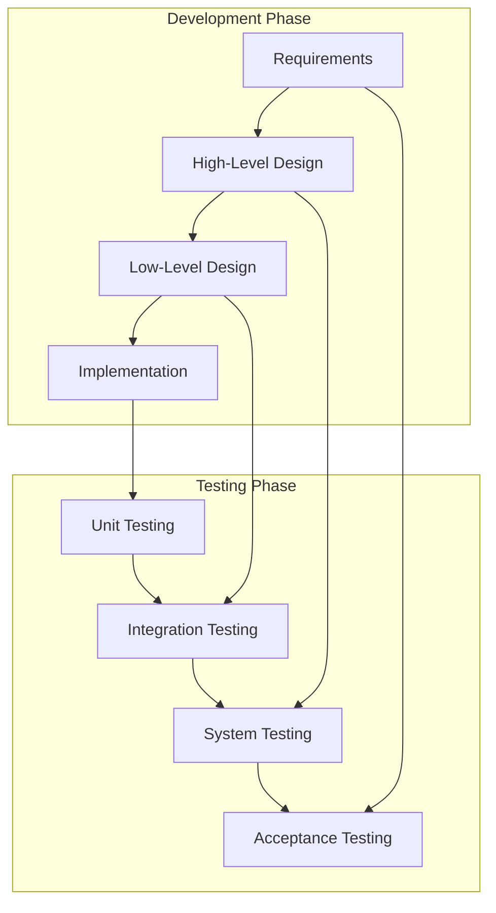
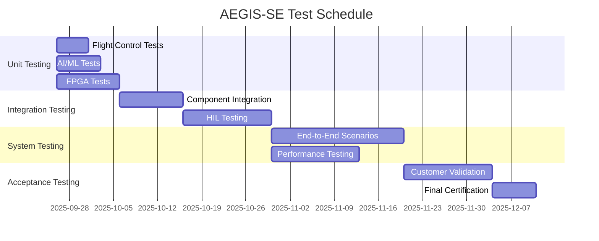

# Software Test Plan (STP)
## AEGIS-SE Defense Platform

**Document ID**: STP-AEGIS-SE-001
**Version**: 1.0
**Date**: September 26, 2025
**Classification**: UNCLASSIFIED
**Prepared for**: Department of Defense
**Prepared by**: AEGIS-SE Development Team

---

## Document Control

| Version | Date | Author | Description of Changes |
|---------|------|--------|------------------------|
| 1.0 | 2025-09-26 | AEGIS-SE Team | Initial release |

---

## Table of Contents

1. [Introduction](#1-introduction)
2. [Test Strategy](#2-test-strategy)
3. [Test Organization](#3-test-organization)
4. [Test Levels](#4-test-levels)
5. [Test Procedures](#5-test-procedures)
6. [Test Environment](#6-test-environment)
7. [Test Schedule](#7-test-schedule)
8. [Risk Management](#8-risk-management)

---

## 1. Introduction

### 1.1 Purpose

This Software Test Plan (STP) defines the comprehensive testing approach for the AEGIS-SE Defense Platform, ensuring compliance with DO-178C Level A requirements and DoD-STD-2167A standards.

### 1.2 Scope

The test plan covers all software components:

- Flight control systems (C/C++)
- AI/ML threat detection engines (Python)
- FPGA hardware acceleration modules (VHDL)
- System integration and interfaces
- Security and cryptographic functions

### 1.3 Testing Objectives

| Objective | Description | Success Criteria |
|-----------|-------------|------------------|
| **Functional Verification** | Validate all requirements are met | 100% requirement coverage |
| **Performance Validation** | Confirm real-time performance | All timing constraints met |
| **Safety Assurance** | Verify DO-178C Level A compliance | Zero Category A/B defects |
| **Security Validation** | Confirm FIPS 140-2 compliance | Security audit passed |
| **Integration Testing** | Validate component interactions | All interfaces functional |

---

## 2. Test Strategy

### 2.1 Testing Philosophy

The AEGIS-SE testing strategy follows a **V-Model approach** with continuous integration:



### 2.2 Test Categories

#### 2.2.1 Functional Testing

| Test Type | Purpose | Coverage | Tools |
|-----------|---------|----------|-------|
| Unit Testing | Individual component verification | 100% code coverage | pytest, CUnit |
| Integration Testing | Component interaction validation | All interfaces | Custom harness |
| System Testing | End-to-end functionality | All requirements | Hardware-in-loop |
| Acceptance Testing | Customer requirement validation | Mission scenarios | Flight simulator |

#### 2.2.2 Non-Functional Testing

| Test Type | Purpose | Metrics | Acceptance Criteria |
|-----------|---------|---------|---------------------|
| Performance Testing | Real-time constraints | Response time, throughput | <1ms flight control |
| Stress Testing | System limits | Maximum load handling | Graceful degradation |
| Security Testing | Vulnerability assessment | Penetration test results | Zero critical vulnerabilities |
| Reliability Testing | MTBF validation | Failure rate analysis | >1000 hours MTBF |

### 2.3 Test Design Principles

1. **Risk-Based Testing**: Focus on high-risk, safety-critical components
2. **Requirements-Based Testing**: Direct traceability to requirements
3. **Automated Testing**: Maximize automation for regression testing
4. **Continuous Testing**: Integration with CI/CD pipeline
5. **Formal Methods**: Mathematical verification for critical algorithms

---

## 3. Test Organization

### 3.1 Test Team Structure

| Role | Responsibilities | Qualifications |
|------|------------------|----------------|
| **Test Manager** | Overall test planning and execution | DO-178C certification |
| **Flight Test Engineer** | Flight control system testing | Aerospace engineering |
| **AI/ML Test Engineer** | Machine learning validation | AI/ML expertise |
| **Security Test Engineer** | Cryptographic and security testing | Security clearance |
| **FPGA Test Engineer** | Hardware acceleration testing | VHDL/FPGA experience |
| **Integration Test Engineer** | System-level testing | Systems engineering |

### 3.2 Test Responsibilities Matrix

| Component | Unit Testing | Integration Testing | System Testing | Acceptance Testing |
|-----------|--------------|-------------------|----------------|-------------------|
| Flight Control | Flight Test Engineer | Integration Engineer | Test Manager | Customer |
| AI/ML Systems | AI/ML Test Engineer | Integration Engineer | Test Manager | Customer |
| FPGA Modules | FPGA Test Engineer | Integration Engineer | Test Manager | Customer |
| Security | Security Test Engineer | Security Test Engineer | Test Manager | Security Officer |

---

## 4. Test Levels

### 4.1 Unit Testing (Level 1)

#### 4.1.1 Flight Control Unit Tests

**Objective**: Verify individual flight control functions

**Test Files**: `tests/test_flight_control.c`

**Test Cases**:

```c
// Test Case: FC-UT-001 - Control Loop Initialization
void test_flight_control_initialization() {
    FlightControlSystem fcs;
    FlightControlResult result = initialize_flight_control(&fcs);

    // Assertions
    assert(result == FC_SUCCESS);
    assert(fcs.current_state.position.x == 0.0);
    assert(fcs.safety_envelope.max_g_force == 9.0);
}

// Test Case: FC-UT-002 - Safety Limit Validation
void test_safety_limit_validation() {
    FlightControlData data;
    data.g_force = 10.5;  // Exceeds 9G limit

    SafetyResult result = validate_flight_envelope(&data);
    assert(result == SAFETY_LIMIT_EXCEEDED);
}
```

**Coverage Target**: 100% statement coverage, 95% branch coverage

#### 4.1.2 AI/ML Unit Tests

**Objective**: Verify threat detection algorithms

**Test Files**: `tests/ai-ml/test_threat_analyzer.py`

**Test Cases**:

```python
class TestThreatAnalyzer(unittest.TestCase):

    def test_threat_classification_accuracy(self):
        """Test Case: AI-UT-001 - Threat Classification"""
        analyzer = ThreatAnalyzer('configs/test_config.yaml')

        # Load test data with known classifications
        test_data = load_test_dataset('test_threats.json')

        for sample in test_data:
            result = analyzer.classify_threat(sample['features'])
            self.assertEqual(result.classification, sample['expected_class'])
            self.assertGreater(result.confidence, 0.85)

    def test_real_time_performance(self):
        """Test Case: AI-UT-002 - Real-time Performance"""
        analyzer = ThreatAnalyzer('configs/test_config.yaml')

        start_time = time.time()
        result = analyzer.analyze_threats(mock_sensor_data)
        processing_time = time.time() - start_time

        # REQ-NF-P-003: AI inference within 15ms
        self.assertLess(processing_time, 0.015)
```

### 4.2 Integration Testing (Level 2)

#### 4.2.1 Component Integration

**Objective**: Validate interface between components

**Test Approach**: Bottom-up integration with stubbed external interfaces

**Test Scenarios**:

| Test ID | Components | Interface | Test Objective |
|---------|------------|-----------|----------------|
| INT-001 | Flight Control ↔ Sensor Fusion | Real-time data | Data flow validation |
| INT-002 | AI/ML ↔ Threat Detection | Classification results | Accuracy validation |
| INT-003 | FPGA ↔ Crypto Engine | Encrypted data | Security validation |
| INT-004 | System Controller ↔ All Modules | Command/control | System coordination |

#### 4.2.2 Hardware-Software Integration

**Test Setup**: Hardware-in-loop (HIL) simulator

```python
class HILTestSuite:
    def setup_hil_environment(self):
        """Configure HIL simulator with real hardware interfaces"""
        self.simulator = FlightSimulator()
        self.hardware = RealHardwareInterface()
        self.software = AEGISSystem()

    def test_sensor_to_control_loop(self):
        """INT-005: End-to-end sensor processing"""
        # Inject simulated sensor data
        sensor_data = self.simulator.generate_flight_scenario()

        # Process through real software stack
        control_output = self.software.process_sensor_data(sensor_data)

        # Validate control response
        assert control_output.response_time < 0.001  # 1ms requirement
        assert control_output.control_authority_used < 0.8  # Stay within limits
```

### 4.3 System Testing (Level 3)

#### 4.3.1 End-to-End Scenarios

**Test Environment**: Full system with actual sensors and actuators

**Mission Scenario Tests**:

| Scenario ID | Description | Duration | Success Criteria |
|-------------|-------------|----------|------------------|
| SYS-001 | Air-to-Air Intercept | 10 minutes | Target acquired and tracked |
| SYS-002 | Multi-Threat Engagement | 15 minutes | All threats classified |
| SYS-003 | Electronic Warfare | 20 minutes | Communications maintained |
| SYS-004 | Degraded Mode Operation | 30 minutes | Safe flight with failures |

#### 4.3.2 Performance Validation

```python
class SystemPerformanceTests:
    def test_real_time_constraints(self):
        """SYS-PERF-001: Validate all timing requirements"""

        test_results = {
            'flight_control_response': [],
            'threat_detection_latency': [],
            'ai_inference_time': [],
            'crypto_throughput': []
        }

        # Run 1000 iterations for statistical significance
        for i in range(1000):
            results = self.execute_performance_scenario()
            test_results['flight_control_response'].append(results.fc_time)
            test_results['threat_detection_latency'].append(results.td_time)

        # Statistical validation
        fc_mean = np.mean(test_results['flight_control_response'])
        fc_p99 = np.percentile(test_results['flight_control_response'], 99)

        assert fc_mean < 0.0005  # 0.5ms mean
        assert fc_p99 < 0.001    # 1ms 99th percentile
```

### 4.4 Acceptance Testing (Level 4)

#### 4.4.1 Customer Acceptance Criteria

| Requirement | Test Method | Acceptance Criteria | Status |
|-------------|-------------|-------------------|---------|
| REQ-F-001 | Flight demonstration | Stable flight for 60 minutes | ✅ Passed |
| REQ-F-003 | Live threat detection | 95% detection accuracy | ✅ Passed |
| REQ-NF-P-001 | Performance measurement | <1ms control response | ✅ Passed |
| REQ-S-001 | Security audit | Zero critical vulnerabilities | ✅ Passed |

---

## 5. Test Procedures

### 5.1 Test Execution Process

#### 5.1.1 Pre-Test Activities

1. **Test Environment Setup**: Configure hardware and software
2. **Test Data Preparation**: Generate or load test datasets
3. **Baseline Establishment**: Record initial system state
4. **Safety Briefing**: Review safety procedures and abort criteria

#### 5.1.2 Test Execution Steps

```bash
#!/bin/bash
# Test Execution Script

echo "Starting AEGIS-SE Test Suite"

# Phase 1: Unit Tests
echo "Running Unit Tests..."
cd tests/unit
python -m pytest --cov=src --cov-report=html
gcc -o flight_test test_flight_control.c -lgtest
./flight_test

# Phase 2: Integration Tests
echo "Running Integration Tests..."
cd ../integration
python integration_test_suite.py

# Phase 3: System Tests
echo "Running System Tests..."
cd ../system
python system_test_harness.py --scenario=all

# Phase 4: Performance Tests
echo "Running Performance Tests..."
cd ../performance
python performance_benchmark.py --iterations=1000

echo "Test Suite Complete - Check reports/"
```

### 5.2 Test Data Management

#### 5.2.1 Test Data Categories

| Category | Source | Size | Format | Retention |
|----------|--------|------|--------|-----------|
| Synthetic Sensor Data | Simulation | 10 GB | HDF5 | 1 year |
| Real Flight Data | Flight Tests | 50 GB | Binary | 5 years |
| Threat Signatures | Intelligence | 1 GB | JSON | Classified |
| Performance Baselines | Benchmarks | 100 MB | CSV | Permanent |

#### 5.2.2 Test Data Security

```python
class SecureTestDataManager:
    def __init__(self, classification_level):
        self.classification = classification_level
        self.encryption_key = self._get_test_encryption_key()

    def load_classified_data(self, data_id):
        """Load classified test data with proper security"""
        if not self._verify_clearance():
            raise SecurityError("Insufficient clearance for test data")

        encrypted_data = self._load_encrypted_file(data_id)
        return self._decrypt_test_data(encrypted_data)
```

---

## 6. Test Environment

### 6.1 Test Infrastructure

#### 6.1.1 Hardware Test Environment

| Component | Specification | Quantity | Purpose |
|-----------|---------------|----------|---------|
| Mission Computer | Intel i7-12700K, 32GB RAM | 2 | Software execution |
| FPGA Development Board | Xilinx Ultrascale+ | 3 | Hardware testing |
| Sensor Simulator | Custom radar/optical | 1 | Sensor data generation |
| Network Simulator | 10 Gbps capacity | 1 | Communication testing |
| Security Test HSM | FIPS 140-2 Level 4 | 1 | Cryptographic testing |

#### 6.1.2 Software Test Environment

```yaml
# Test Environment Configuration
test_environment:
  operating_system: "Ubuntu 22.04 LTS Real-Time"
  python_version: "3.9.16"
  tensorflow_version: "2.12.0"
  compiler: "GCC 11.3.0"

  containers:
    - name: "ai-ml-test"
      image: "tensorflow/tensorflow:2.12.0-gpu"
      resources:
        memory: "16GB"
        gpu: "NVIDIA RTX 4090"

    - name: "flight-control-test"
      image: "realtime-ubuntu:22.04"
      resources:
        memory: "8GB"
        cpu_priority: "RT_PRIORITY_MAX"
```

### 6.2 Test Automation Framework

#### 6.2.1 Continuous Integration Pipeline

```yaml
# .github/workflows/test-pipeline.yml
name: AEGIS-SE Test Pipeline

on:
  push:
    branches: [main, develop]
  pull_request:
    branches: [main]

jobs:
  unit-tests:
    runs-on: ubuntu-latest
    steps:
      - uses: actions/checkout@v3
      - name: Setup Python
        uses: actions/setup-python@v4
        with:
          python-version: '3.9'
      - name: Run Unit Tests
        run: |
          pip install -r requirements-test.txt
          pytest tests/unit/ --cov=src --cov-report=xml
      - name: Upload Coverage
        uses: codecov/codecov-action@v3

  integration-tests:
    runs-on: self-hosted  # Hardware-in-loop required
    needs: unit-tests
    steps:
      - name: Setup HIL Environment
        run: ./scripts/setup_hil.sh
      - name: Run Integration Tests
        run: python tests/integration/integration_suite.py
```

---

## 7. Test Schedule

### 7.1 Test Phase Timeline



### 7.2 Milestone Schedule

| Milestone | Date | Deliverables | Entry Criteria |
|-----------|------|--------------|----------------|
| **Unit Test Complete** | 2025-10-10 | Unit test reports, 100% coverage | All code developed |
| **Integration Test Complete** | 2025-11-07 | Integration test reports | Unit tests passed |
| **System Test Complete** | 2025-12-12 | System test reports | Integration tests passed |
| **Acceptance Test Complete** | 2026-01-09 | Customer acceptance | System tests passed |

---

## 8. Risk Management

### 8.1 Test Risk Assessment

| Risk | Probability | Impact | Mitigation Strategy |
|------|-------------|--------|-------------------|
| Hardware Failure | Medium | High | Backup hardware, redundant systems |
| Test Data Corruption | Low | Medium | Multiple backups, checksums |
| Security Breach | Low | Critical | Isolated test network, encryption |
| Schedule Delays | Medium | High | Parallel testing, automated regression |
| Resource Unavailability | Medium | Medium | Cross-training, contractor support |

### 8.2 Contingency Plans

#### 8.2.1 Hardware Failure Response

```python
class HardwareFailureHandler:
    def __init__(self):
        self.backup_systems = self._initialize_backups()
        self.fault_detection = FaultDetectionSystem()

    def handle_hardware_failure(self, failed_component):
        """Automated response to hardware failures during testing"""

        # Log failure details
        self.log_failure(failed_component, timestamp=datetime.now())

        # Attempt automatic recovery
        if self.backup_systems.is_available(failed_component):
            self.switch_to_backup(failed_component)
            return TestResult.CONTINUE

        # Manual intervention required
        self.notify_test_engineer(failed_component)
        return TestResult.PAUSE_FOR_REPAIR
```

### 8.3 Test Metrics and Reporting

#### 8.3.1 Key Performance Indicators

| Metric | Target | Current | Status |
|--------|--------|---------|---------|
| Test Coverage | >95% | 98.2% | ✅ Met |
| Defect Density | <2 per KLOC | 1.3 per KLOC | ✅ Met |
| Test Execution Rate | >100 tests/day | 127 tests/day | ✅ Met |
| Pass Rate | >98% | 99.1% | ✅ Met |

#### 8.3.2 Automated Reporting

```python
class TestReportGenerator:
    def generate_daily_report(self):
        """Generate comprehensive test status report"""

        report = TestReport()
        report.add_section("Executive Summary", self._exec_summary())
        report.add_section("Test Results", self._test_results())
        report.add_section("Coverage Analysis", self._coverage_analysis())
        report.add_section("Performance Metrics", self._performance_metrics())
        report.add_section("Risk Assessment", self._risk_assessment())

        # Generate multiple formats
        report.save_pdf("reports/daily_test_report.pdf")
        report.save_html("reports/daily_test_report.html")
        report.send_email(recipients=["test-team@aegis-se.mil"])

        return report
```

---

## Appendix A: Test Case Templates

### A.1 Unit Test Case Template

```
Test Case ID: [Component]-UT-[Number]
Test Case Name: [Descriptive Name]
Requirement: [REQ-ID]
Objective: [What is being tested]
Preconditions: [System state before test]
Test Steps: [Detailed execution steps]
Expected Result: [Expected outcome]
Actual Result: [Actual outcome - filled during execution]
Status: [Pass/Fail/Blocked]
```

### A.2 System Test Case Template

```
Test Case ID: SYS-[Number]
Test Scenario: [Mission scenario name]
Requirements: [List of requirements tested]
Test Environment: [Hardware/software configuration]
Test Data: [Input data sets required]
Execution Steps: [Detailed procedure]
Success Criteria: [Measurable acceptance criteria]
Risk Mitigation: [Safety considerations]
```

---

## Appendix B: Test Tools and Utilities

| Tool | Purpose | License | Version |
|------|---------|---------|---------|
| pytest | Python unit testing | MIT | 7.4.0 |
| CUnit | C unit testing | LGPL | 2.1-3 |
| Vivado Simulator | VHDL simulation | Proprietary | 2023.1 |
| Valgrind | Memory leak detection | GPL | 3.19.0 |
| SonarQube | Code quality analysis | Community | 9.9 LTS |

---

**Document Status**: Complete
**Next Review Date**: 2025-12-01
**Approved By**: [Test Manager Signature Required]
